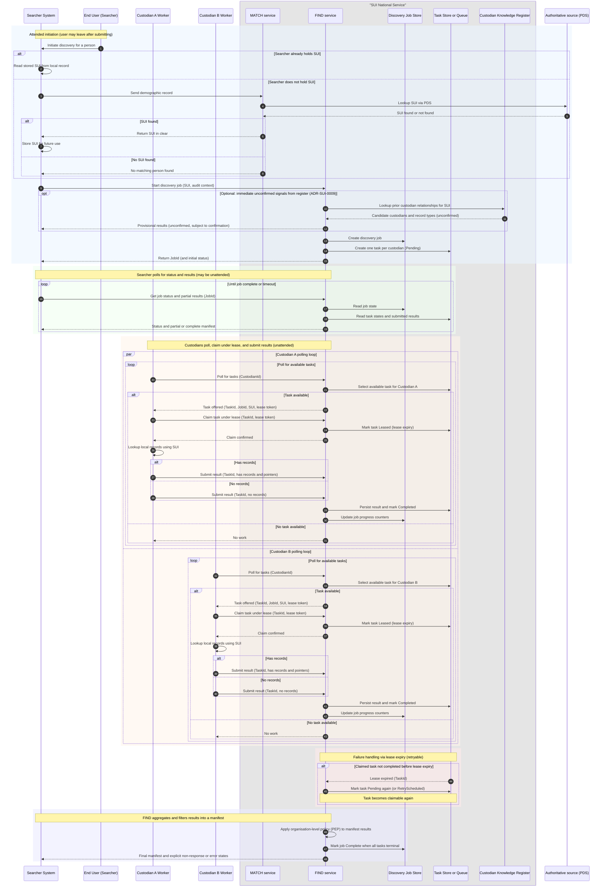
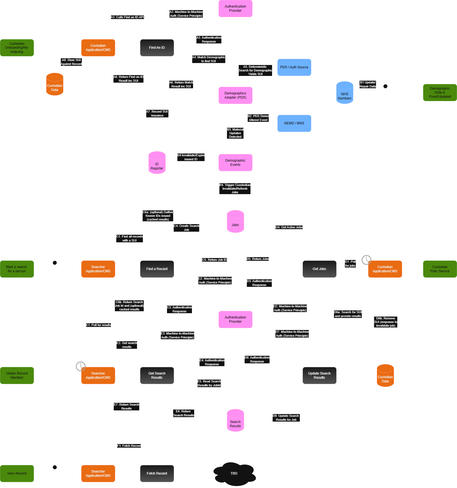

# ADR-SUI-0012: Asynchronous Pull-Based Discovery for FIND

Date: 29 January 2026  
Author: Simon Parsons  
Decision owners: SUI Service Team  
Category: Distributed discovery architecture

## Status
Proposed

---

## Context

Two principal architectural designs are being actively considered for how identity is managed within SUI National.

1) **Distributed ID**  
   Custodians are issued a SUI by the central service and are expected to store that identifier within their own systems. The identifier is then used for local matching and for responding to discovery and refresh requests from FIND.

2) **Managed ID Register**  
   The central service maintains an authoritative register of identities and retains knowledge of which custodians hold records for which people. Custodians do not store a shared identifier and rely on the central service for identity resolution.

An identity register exists in both designs, but it plays fundamentally different roles.

In the Managed ID Register model, the register is the operational source of truth and directly answers the question “who knows about this person?”.

In the Distributed ID model, the register exists primarily as a control and coordination mechanism. It records when SUIs are issued, which custodians they have been issued to, and supports lifecycle management such as invalidation, refresh, and expiry. It does not replace distributed custody, but enables the central service to reason about the health and validity of identifiers across the ecosystem.

This ADR is concerned specifically with the **internal architecture and integration pattern for the FIND service within the Distributed ID model**.

The FIND-A-RECORD service is responsible for discovering which custodians hold records for a given person identifier (SUI) and returning pointers to those records. A searcher asks “who has data?”, FIND must coordinate an ecosystem of custodians, and the output is an aggregated manifest of where records exist.

Within the Distributed ID architecture, two alternative interaction patterns are being considered for how this discovery process should operate:

1) **Push fan-out**, where the central FIND service actively calls custodian-provided endpoints to request confirmation and record pointers.

2) **Pull polling**, where FIND publishes discovery tasks and custodians poll FIND for work, perform local lookups, and submit results.

Both approaches are technically viable within the Distributed ID design. However, they represent fundamentally different positions in terms of onboarding friction, operational complexity, failure handling, and long-term scalability.

This ADR records the analysis of both patterns and the resulting architectural preference.

## Decision

Within the **Distributed ID architecture**, the SUI discovery model will adopt a **pull-based interaction pattern** as the primary integration approach.

Discovery will operate as a job workflow:

- A searcher initiates discovery with FIND.
- FIND creates a discovery job and creates a task for each participating custodian.
- Custodians poll FIND for tasks, claim tasks using a leasing mechanism, perform local lookups, and submit results back to FIND.
- Searchers query FIND for job status and results, including partial results where appropriate.

Push-based fan-out, where FIND directly calls custodian discovery endpoints as the primary mechanism, will not be used.

A webhook notification mechanism may be introduced as an enhancement, but webhooks are strictly optional and polling remains the canonical and mandatory integration model.

## Rationale

The push fan-out model requires each custodian to expose and operate an inbound discovery API and requires FIND to maintain a catalogue of custodian endpoints, authentication methods, and operational constraints. This creates immediate friction for onboarding organisations and forces FIND to carry integration complexity that scales linearly with the number of custodians.

It also concentrates failure modes in the central platform. FIND must guess appropriate timeouts, retry strategies, and concurrency limits for systems it does not control. A single slow or unstable custodian can degrade the overall discovery experience unless explicitly isolated through complex orchestration logic.

More fundamentally, the push model misrepresents the nature of discovery. Discovery is not a single operation. It is a distributed coordination problem whose outcome depends on multiple independent systems responding over time.

The pull-based model aligns the architecture with this reality.

Under the pull model, FIND publishes discovery work as tasks. Custodians integrate once using an outbound-only client, poll FIND for tasks assigned to them, claim tasks under a lease, perform local lookups, and submit results back to FIND.

The moment a custodian claims a task is the moment the system knows the request has been received. There is no reliance on best-effort outbound calls, and no requirement for FIND to maintain per-custodian connectivity logic.

Operational backpressure moves to the correct place. Custodians control their own throughput by polling rate and task claim behaviour. If a custodian is unavailable, tasks remain pending. FIND does not need to infer retry policies for external systems.

Discovery becomes naturally asynchronous and observable. Searchers can see job state, partial results, and which custodians have responded. This is a more accurate and supportable model than pretending discovery is synchronous.

## Options Considered

### Option A – Push Fan-Out

FIND maintains a catalogue of custodian endpoints and actively calls those endpoints during discovery to request confirmation and record pointers.

### Option B – Pull Polling

FIND creates discovery tasks and custodians poll FIND for work, claim tasks, perform local lookups, and submit results.

### Option C – Hybrid Pull + Webhooks

Same as Option B, with optional webhook notifications sent by FIND to custodians indicating that new tasks are available. Webhooks are not a replacement for polling.

## Overall Indicative Direction

The preferred architectural direction is **Option B – Pull Polling**.

Option C is a performance optimisation that may be introduced later, but does not change the fundamental interaction model.

Option A is not suitable as the primary architecture due to onboarding friction, operational coupling, and concentration of failure modes in the central platform.

## Consequences

### Positive

Custodian onboarding becomes materially simpler. Custodians no longer need to expose and operate inbound discovery APIs and can integrate using a single outbound client.

Operational complexity is reduced in the central platform. FIND no longer needs to maintain per-custodian connectivity metadata or synchronously orchestrate calls to heterogeneous systems.

Backpressure becomes a natural property of the system. Custodians regulate their own workload through polling frequency and leasing behaviour.

Discovery becomes observable as a workflow. Partial results, non-response, and retry behaviour are explicit and supportable.

Optional webhooks can be introduced without creating a parallel integration model.

### Trade-offs / Risks

FIND must operate a durable job and task system with leasing semantics, retries, and idempotency.

Discovery becomes job-based rather than pretending to be an instant synchronous response. Searchers must handle job status and result retrieval.

Webhook capability introduces optional complexity and must be treated as best-effort.

These trade-offs are considered acceptable and preferable to the structural fragility and onboarding burden of the push fan-out model.

---

## Design Detail

### Discovery as a Job

Discovery is treated as a first-class workflow. A discovery job is created per search request and is associated with a subject identifier and audit context.

Each job generates one task per participating custodian. Tasks represent the unit of work and are persisted centrally.

### Task Receipt and Leasing

A task is considered received when it is claimed by a custodian under a lease. The lease prevents concurrent processing and provides deterministic audit of when the custodian took responsibility for the task.

If a lease expires, the task becomes available again, enabling safe retry in the event of custodian failure.

### Result Semantics

Custodians respond with:

- has records (with pointers),
- no records (definitive negative),
- temporary error (retryable),
- permanent error (non-retryable).

This distinction is critical for expressing real operational state and avoiding conflation of “no data” with “no response”.

### Provisional results and use of the identity register

In addition to confirmed results returned by custodians, the platform may provide
**provisional discovery signals** while a job is still in progress.

As described in **ADR-SUI-0009 (Central Custodian Knowledge Register)**, the service
maintains a register of previously observed relationships between people and custodians.
This register may be used as a **cache or hinting mechanism** to surface immediate,
unconfirmed indications of which custodians are likely to hold records for a given SUI.

Where used, such results must be:
- clearly marked as **unconfirmed**,
- distinguishable from custodian-confirmed responses,
- and treated as advisory rather than authoritative.

Confirmed discovery outcomes are always derived from custodian task responses within
the current discovery job. Provisional signals from the register must not affect the
correctness of the final result set and must be reconciled as confirmations are received.

### Encounter Signalling

The platform may maintain an encounter register indicating which custodians have previously responded for a given subject identifier. This can be used to provide “likely custodians” signals and to optimise scheduling, but must not affect correctness.

### Identity lifecycle tasks and architectural implications

In the Distributed ID model, discovery is not the only cross-custodian operation that the central service must coordinate.

The identity register also supports lifecycle operations such as:

- invalidating identifiers when data quality issues are detected,
- triggering refresh when identity confidence degrades,
- expiring identifiers after policy-defined time windows,
- reissuing identifiers when authoritative data changes.

Each of these events requires coordinated action across the same set of custodians that participate in discovery.

Under a pull-based architecture, these operations naturally become additional task types alongside discovery. Refresh, invalidation, and expiry can be modelled as first-class tasks issued by FIND and processed by custodians using the same polling and leasing mechanisms.

This provides a unified coordination model for all identity-related workflows, not just discovery. The platform does not need separate delivery mechanisms for different types of identity work, and custodians do not need to implement multiple integration patterns.

This significantly strengthens the architectural case for polling. The system is no longer optimised only for “find who has data”, but for the full lifecycle of identity management in a distributed custody environment.

## End-to-end discovery flow (illustrative)

The following sequence diagram illustrates the preferred pull-based discovery flow
within the Distributed ID architecture. It shows attended initiation, unattended
processing, optional provisional signals, and incremental result availability.

### Narrative walkthrough

- A search is initiated by a user through a consuming application. The user may leave
  after submitting the request.

- The searcher application authenticates to the national discovery service and starts
  a discovery job using a known SUI, or obtains one via MATCH if required.

- Optionally, the service may consult the custodian knowledge register
  (ADR-SUI-0009) to return **immediate, unconfirmed discovery signals**. These are
  explicitly provisional and do not affect the correctness of the final result.

- The discovery service creates a job and generates one task per participating custodian.

- Custodians poll the service for available tasks using unattended,
  machine-to-machine authentication.

- When a custodian claims a task under a lease, responsibility for processing is
  explicitly established and observable.

- The custodian performs a local lookup using the SUI and submits one of the defined
  result types (records found, no records, temporary error, or permanent error).

- Results are persisted as they arrive. Searchers may poll for job status and retrieve
  **partial results** throughout execution.

- If a custodian fails to complete a task before the lease expires, the task becomes
  eligible for retry without manual intervention.

- Once all tasks reach a terminal state, the job is marked complete and the final
  manifest is returned to the searcher, with non-responses and errors made explicit.

This flow reflects the asynchronous and distributed nature of discovery and avoids
conflating historical knowledge, provisional signals, and confirmed results.

<<<<<<< HEAD
### Highlevl Architecture
=======
### High-level Architecture
>>>>>>> main

### Optional Webhook Notification

Webhooks may be used to notify custodians that tasks are available. Webhooks are not used to deliver task payloads and do not replace polling.

They are strictly a wake-up signal and must be treated as best-effort.

---

## Summary

The pull-based discovery model provides a simpler, more resilient, and more honest representation of the discovery problem. It reduces onboarding friction, isolates operational failure, and aligns the SUI architecture with asynchronous-by-default principles.

By supporting discovery, refresh, invalidation, and expiry through the same task coordination mechanism, this design provides a coherent and future-proof foundation for identity management in a distributed custody environment.

This is the preferred interaction model for SUI National within the Distributed ID architecture.

