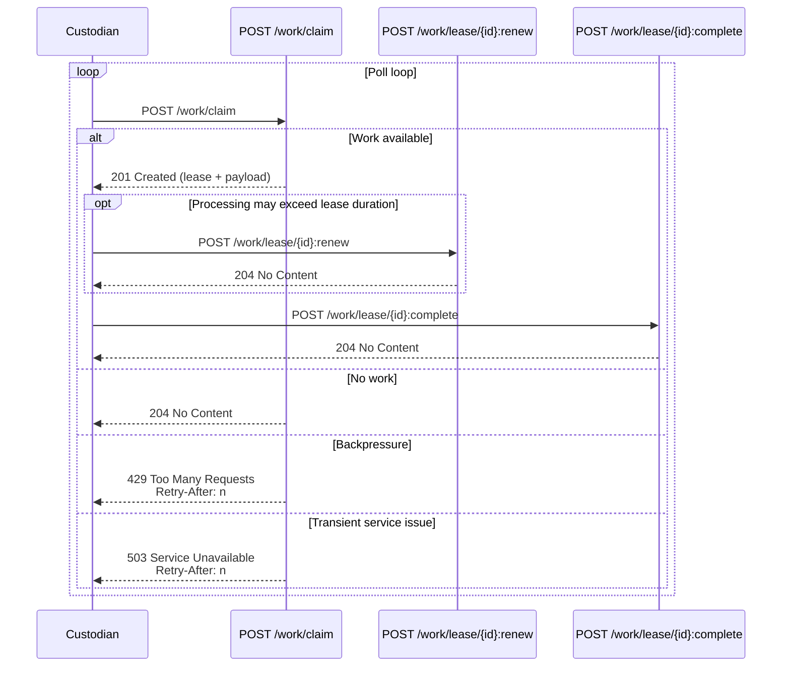

# ADR-SUI-0018: High-Performance Polling for Pull-Based Discovery

Date: 17 February 2026  
Author: Simon Parsons  
Decision owners: SUI Service Team  
Category: Distributed discovery architecture (custodian integration)  

---

## Status

Proposed (for Alpha baseline)

---

## 1. Context and Problem Statement
FIND implements a pull-based discovery model. Custodians do not receive pushed notifications; instead, they poll FIND to:

1. Detect whether work exists.  
2. Claim work under a lease.  
3. Perform local lookup.  
4. Submit results.

Polling was selected over push/webhook models because it:

- Avoids inbound firewall exceptions at custodian sites.  
- Reduces operational dependency on callback reliability.  
- Simplifies replay and recovery behaviour.  
- Allows custodians to control concurrency and rate.

However, polling introduces a potential scaling risk:

- Most polls return “no work”.  
- Polling is continuous.  
- Polling endpoints may become hot paths under multi-custodian load.

Therefore, the polling interaction must:

- Minimise idle resource consumption.  
- Convert requests into progress wherever possible.  
- Avoid race conditions.  
- Behave safely behind enterprise proxies.  
- Support backpressure and throttling.  
- Remain simple to implement using standard HTTP clients.

This ADR evaluates polling patterns and determines the most efficient and robust endpoint design for Alpha and beyond.

### Scope and non-goals
This ADR defines the **custodian-facing polling and claim endpoint structure** and its behavioural contract (status codes, race safety, and backpressure).

This ADR does **not** define internal broker/cache/storage design, durable state models, or audit pipelines. Those are addressed in separate ADRs.

---

## 2. Architectural Constraints
The design must assume:

- Multiple custodians polling independently.  
- Possible concurrent polling from the same custodian.  
- Network retries and transient failures.  
- Standard HTTP client stacks.  
- Deployment behind load balancers and reverse proxies.  
- Enterprise proxy behaviour (timeouts, caching, header rewriting).  

The polling interaction MUST:

- Be correct under retries (clients may repeat requests).  
- Avoid an availability “check-then-claim” race.  
- Avoid reliance on non-standard HTTP behaviour.  
- Support backpressure signalling (`429`, `503`, `Retry-After`).  
- Be implementable using standard HTTP clients over HTTP/1.1.  

---

## 3. Evaluation Criteria
Options are evaluated against the following criteria:

| Criterion | Importance |
|---|---|
| Idle efficiency | Critical |
| Request count under load | Critical |
| Race safety | Critical |
| Client complexity | High |
| Proxy compatibility | Medium |
| Backpressure support | High |
| Observability integration | High |

---

## 4. Options Considered

## Option A — Two-Step: `HEAD` Probe then Claim

### Pattern
1. `HEAD /work/available`  
2. If 200 → `GET` or `POST` to claim

### Characteristics
- Availability and claim are separate operations.  
- HEAD response contains no body.

### Technical Analysis
The dominant cost of polling is the availability check, not the response payload size. Even a HEAD request requires:

- Determining whether work exists.  
- Likely performing a storage read or cache lookup.

When work exists:

- Two requests are required.  
- A race condition exists between probe and claim.

### Pros
- Very small idle response payload.  
- Clear conceptual separation of “check” and “claim”.  
- Backoff signalling possible via `Retry-After`.

### Cons
- Two round trips for each successful claim.  
- Race between probe and claim.  
- Encourages tight polling loops if misused.  
- Does not reduce availability lookup cost.  
- HEAD handling inconsistencies in some enterprise infrastructures.

## Option B — GET Poll (Peek) then Claim

### Pattern
1. `GET /work`  
2. If work indicated → second call to lease

### Pros
- Idle case cheap (`204`).  
- Standard semantics.

### Cons
- Still requires two calls for progress.  
- Still subject to race between “peek” and “claim”.  
- Increased request volume compared to atomic claim.

## Option C — Single-Step Atomic Claim (Poll and Lease in One Operation)

### Pattern
`POST /work/claim`

- Atomically select next available work item.  
- Claim it.  
- Return lease and payload.  
- If none available → `204 No Content`.

### Pros
- One request per successful claim.  
- Eliminates availability race.  
- Lowest total request volume.  
- Simplest client loop.

### Cons
- Requires correct atomic implementation (addressed elsewhere).

## Option D — Long Polling (Optional Layer)

### Pattern
`POST /work/claim?waitSeconds=20`

- Server holds request open until work available or timeout.

### Pros
- Reduces QPS dramatically when idle.  
- Reduces latency between work arrival and claim.

### Cons
- Requires careful tuning of thread pool and proxy timeouts.  
- Increases reliance on intermediary timeout behaviour.

---

## 5. Comparative Summary

| Dimension | HEAD + Claim | Peek + Claim | Atomic Claim | Atomic Claim + Long Poll |
|---|---|---|---|---|
| Availability detection requires separate request | ✅ Yes | ✅ Yes | ❌ No | ❌ No |
| Requests required to successfully claim work | ❌ 2 | ❌ 2 | ✅ 1 | ✅ 1 |
| Availability race window | ❌ Yes | ❌ Yes | ✅ No | ✅ No |
| Idle request volume when no work exists | ❌ High | ❌ High | ❌ High | ✅ Low |
| Server holds connections open while idle | ❌ No | ❌ No | ❌ No | ⚠️ Yes |
| Reliance on proxy / gateway timeout behaviour | ✅ Low | ✅ Low | ✅ Low | ❌ High |
| Risk of “stuck” clients due to intermediate network devices | ✅ Low | ✅ Low | ✅ Low | ❌ Higher |
| Capacity pressure focus | ⚠️ QPS-bound | ⚠️ QPS-bound | ⚠️ QPS-bound | ❌ Connection-bound |
| Operational tuning required (timeouts, keep-alives, scaling limits) | ✅ Low | ✅ Low | ⚠️ Low–Medium | ❌ High |
| Latency between work arrival and claim | ❌ Poll-interval bound | ❌ Poll-interval bound | ❌ Poll-interval bound | ✅ Near-immediate |
| Client implementation complexity | ⚠️ Moderate | ⚠️ Moderate | ✅ Simple | ✅ Simple |
| Operational predictability in enterprise environments | ⚠️ Medium | ✅ High | ✅ High | ⚠️ Medium |

---

## 6. HTTP/2 Considerations

### What HTTP/2 Provides
- Connection multiplexing.  
- Header compression.  
- Reduced TCP connection overhead.  
- Improved performance under high concurrency.

### What HTTP/2 Does Not Solve
- It does not eliminate race conditions.  
- It does not reduce request count.  
- It does not reduce logical polling frequency.

### Conclusion on HTTP/2
HTTP/2 MAY be enabled and is beneficial under high concurrency.

However, atomic claim provides greater efficiency gains than HTTP/2 alone.

The system SHALL function correctly over HTTP/1.1.  
HTTP/2 SHALL NOT be mandatory.

---

## 7. Decision
1. FIND SHALL implement single-step atomic claim as the canonical polling mechanism.  
2. `POST /work/claim` SHALL be the canonical poll endpoint and SHALL perform availability detection and lease acquisition as a single operation.  
3. If work is available, the response SHOULD be `201 Created` with lease metadata and payload. The response SHALL include `jobId` and `leaseId`, and MAY include `searchId` and any client-provided correlation identifier.  
4. If no work is available, the response SHALL be `204 No Content`.  
5. Polling/lease responses SHOULD include `Cache-Control: no-store` to minimise proxy caching distortion risk in enterprise networks.  
6. Backpressure SHALL be signalled using `429` and `503`, and MAY include `Retry-After`.  
7. The system SHOULD accept and propagate W3C Trace Context (`traceparent`) for end-to-end correlation.  
8. HEAD probing MAY be supported as advisory only. HEAD SHALL NOT be relied upon for correctness.  
9. Long polling SHALL NOT be adopted as part of the Alpha baseline. Any future introduction of long polling SHALL be evaluated in a dedicated ADR focused on connection-bound operational constraints.  
10. Results submission endpoints MUST include `jobId` and `leaseId` so that result submission can be deterministically correlated with the lease that was issued.

---

## 8. Consequences

### Positive
- Minimal request volume for progress.  
- Reduced concurrency risk.  
- Cleaner lease semantics.  
- Predictable behaviour for standard HTTP clients behind enterprise proxies.

### Trade-offs
- Requires disciplined client backoff. `429` and `503` MAY include `Retry-After`.  
- Idle polling still generates request load; the contract relies on backoff and throttling signals to prevent tight loops.

### Security and observability notes (minimal)
- Custodian polling SHALL use TLS and token-based authentication; rate limiting SHOULD be enforced per custodian (`429`) with `Retry-After`.  
- Metrics/traces/logs SHOULD record claim outcomes (`201` vs `204`), lease lifecycle (renew/complete/expire), `jobId`, `leaseId`, and correlation IDs (`traceparent`).

---

## 9. Final Conclusion
For high-performance polling in a multi-custodian distributed architecture, the most efficient and robust design is to combine availability detection and lease acquisition into a single atomic operation.

HTTP/2 improves transport efficiency but does not change the fundamental cost model of polling.

---

## Appendix (informative) — Custodian claim/lease interaction (custodian perspective)

