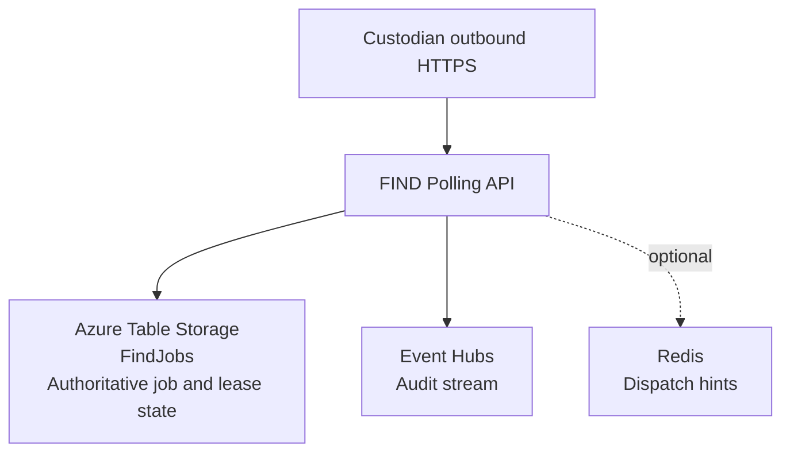

# ADR-SUI-0019: Job Broker and Lease State

Date: 17 February 2026  
Author: Simon Parsons  
Decision owners: SUI Service Team  
Category: Distributed discovery architecture (custodian integration)

---

## Status

Proposed

---

## Executive Summary

ADR-SUI-0018 defines how custodians poll FIND and claim work under a time-bound lease. This ADR defines the minimum infrastructure and storage model required to make that lease model correct, fast, and easy to operate during Alpha.

The Alpha baseline uses **Azure Table Storage as the single source of truth** for job state and lease state. The design intentionally avoids background sweepers and avoids write-heavy indexing. The aim is to keep Table Storage interactions minimal:

- **No-work poll:** one partition-scoped query returning `204`  
- **Successful claim:** one query + one conditional update  
- **Completion:** one conditional update  

Redis is **not** part of the Alpha baseline. It is explicitly deferred as an optional optimisation to suppress idle reads if telemetry proves it is needed.

This ADR covers broker/storage only. It does not redefine endpoint semantics (see ADR‑SUI‑0018).

---

## 1. Context

FIND implements a pull-based discovery model. Custodians poll FIND to claim work, perform local lookup, and submit results. The dominant cost driver in polling systems is usually the idle case (many polls returning “no work”). Therefore the Alpha design must keep both of these true:

1. **Correctness:** only one custodian can hold a lease for a given job at any moment.  
2. **Efficiency:** maintaining lease state must not be onerous; Table transactions must be minimised and access patterns must avoid scans.

This ADR assumes enterprise deployments behind proxies and load balancers, and standard HTTP client stacks.

---

## 2. Non‑Negotiable Requirements

### 2.1 Correctness invariant

At any moment, a job SHALL be leased to at most one custodian.

### 2.2 Minimal state maintenance

- Lease expiry MUST NOT require a background process to “flip state back”.  
- Polling MUST NOT require repeated multi-step reads in the idle case.  
- Writes MUST be limited to the moments where progress occurs (enqueue, claim, complete, explicit renew if enabled).

### 2.3 Partition‑scoped access patterns

- “Find me work for custodian X” MUST be achievable without full-table scans.  
- Any scaling strategy MUST be explicit about hot partitions and sharding.

---

## 3. Decision

### 3.1 Alpha baseline decision

FIND SHALL store durable job metadata and lease state in **Azure Table Storage** using a single authoritative table (`FindJobs`).

Leasing SHALL be represented as **lease overlay fields** (owner/id/expiry). The lifecycle state SHALL remain separate and SHALL NOT require a “Leased” state that must be reverted on expiry.

All claim/complete transitions SHALL be enforced using optimistic concurrency (ETag + `If-Match`). Where two claimers race, one update succeeds and the other fails deterministically (`412 Precondition Failed`).

### 3.2 Deferred optimisation

Redis MAY be introduced later only to suppress idle reads and reduce claim latency, but it SHALL remain non-authoritative and fully disposable. Correctness SHALL never depend on Redis.

---

## 4. Why Azure Table Storage for Alpha

Azure Table Storage is selected because it supports the Alpha requirements with minimal operational overhead:

- **Deterministic exclusivity without locks:** optimistic concurrency provides a clean “winner/loser” claim outcome under contention, avoiding distributed locks.  
- **Low operational burden:** no database engine to patch/tune; capacity planning is simpler during Alpha learning.  
- **Entity-centric model fit:** the job and lease are naturally modelled as a single entity with atomic transitions.  
- **Minimal write amplification:** the baseline requires no additional index tables and no background maintenance tasks.

Table Storage is not chosen because it is universally best; it is chosen because it is sufficient for Alpha while keeping the architecture simple and defendable.

---

## 5. Why not Service Bus or a relational queue table for Alpha

### 5.1 Broker-first (Service Bus)

A broker provides built-in visibility locks and settlement semantics, which is attractive for competing consumers. However, it typically still requires a separate durable store for rich job metadata, correlation, attempts, and lease lifecycle diagnostics. That yields a two-system design at MVP and couples behaviour to broker semantics rather than a service-owned lease model.

This remains a viable future direction, but is not required to satisfy Alpha correctness.

### 5.2 Relational queue table (Postgres/SQL)

Relational queues provide strong transactional semantics and mature patterns. The trade-off is operational overhead and the need to manage contention, connection pooling, and database health. Alpha does not yet justify paying that cost unless telemetry forces it.

---

## 6. Storage Model

### 6.1 Table: `FindJobs` (authoritative)

One entity per job.

#### Keys

- `PartitionKey`: `custodianId|shard`  
- `RowKey`: `{CreatedAtUtcTicks:D20}|{jobId}`

The RowKey embeds a monotonic time prefix to support stable “oldest-first” selection within a partition without secondary indexes.

#### Properties

| Property | Type | Meaning |
|---|---|---|
| State | string | `Ready`, `Completed`, `Failed` |
| NextVisibleAtUtc | datetime | When the job becomes claimable again |
| LeaseOwner | string? | Custodian identifier that holds the current lease |
| LeaseId | string? | Unique lease token |
| LeaseExpiresAtUtc | datetime? | Lease end time |
| AttemptCount | int | Number of times the job has been claimed |
| CreatedAtUtc | datetime | Creation timestamp |
| UpdatedAtUtc | datetime | Last update timestamp |
| PayloadRef | string | Pointer to payload (e.g. blob key) if payload is large |
| CorrelationId | string | Trace/audit correlation |

#### Core idea: visibility is time-based, not state-based

A job is claimable when:

- `State = Ready`  
- AND `NextVisibleAtUtc <= now`

When a lease is acquired, the system sets:

- `NextVisibleAtUtc = LeaseExpiresAtUtc`

This means the job becomes invisible purely by moving `NextVisibleAtUtc` forward. When the lease expires, the job becomes eligible again automatically because time moves on. No background work is required.

This avoids the “who flips State back on expiry?” trap entirely.

---

## 7. Access Patterns and Transaction Counts

This section is deliberately explicit because the “minimal transactions” requirement is critical.

### 7.1 Enqueue a job (progress event)

**Transactions:** 1 write

Insert `FindJobs` entity:

- `State = Ready`
- `NextVisibleAtUtc = now`
- `AttemptCount = 0`
- Lease fields null

### 7.2 Poll / claim a job (progress event)

**Idle case (no work)**  
**Transactions:** 1 query

Query within `custodianId|shard` partition:

- Filter: `State == "Ready" AND NextVisibleAtUtc <= now`
- Order: by RowKey (natural)
- Top: 1

If no entity returned: respond `204`.

**Successful claim**  
**Transactions:** 1 query + 1 conditional update

For the selected entity, attempt conditional update (`If-Match` ETag):

- `LeaseOwner = custodianId`
- `LeaseId = new GUID`
- `LeaseExpiresAtUtc = now + leaseDuration`
- `NextVisibleAtUtc = LeaseExpiresAtUtc`
- `AttemptCount = AttemptCount + 1`
- `UpdatedAtUtc = now`

If conditional update fails (`412`), treat as a lost race and return `204` or retry once with the next candidate (policy defined in ADR‑SUI‑0018).

### 7.3 Complete a job (progress event)

**Transactions:** 1 conditional update

- `State = Completed` (or `Failed`)
- Optionally clear lease fields
- `UpdatedAtUtc = now`

### 7.4 Renew a lease (optional)

Renew is optional for Alpha and SHOULD only exist if processing time can exceed the lease duration.

**Transactions:** 1 conditional update

- Verify `LeaseId` matches
- Extend `LeaseExpiresAtUtc`
- Set `NextVisibleAtUtc = LeaseExpiresAtUtc`

If renew is not implemented, the job simply becomes eligible again after expiry.

---

## 8. Partitioning and Sharding Strategy

Azure Table throughput is partition-bound. The baseline therefore makes sharding explicit in the PartitionKey from day one.

### 8.1 Baseline

- Start with a single shard per custodian: `custodianId|00`.

### 8.2 Scaling via shards (when needed)

If a custodian becomes hot, introduce more shards:

- `custodianId|00`, `custodianId|01`, `custodianId|02`, …

**Shard assignment for new jobs** is deterministic:

- `shard = hash(jobId) mod N`

**Claim selection across shards** remains simple for Alpha:

- The API tries a small bounded set of shards per poll (e.g. round‑robin starting point per instance).  
- The shard count is configuration, not implicit behaviour.

The intent is to keep queries partition-scoped while retaining the ability to spread load if a single custodian becomes a throughput hotspot.

### 8.3 Telemetry triggers

Shard introduction decisions are driven by telemetry:

- sustained claim latency increases  
- partition throttling signals  
- elevated retry rates on Table operations  

---

## 9. Backpressure, Idle Efficiency, and Why Redis is Deferred

In polling systems, the primary lever for idle efficiency is not storage choice; it is client behaviour (backoff) and server backpressure.

Alpha SHALL rely on:

- `204` responses when no work exists  
- `429` / `503` with `Retry-After` when throttling is required  
- mandatory client jitter/backoff (defined in ADR‑SUI‑0018)

Redis is deferred because introducing it by default increases operational surface area. If telemetry later shows that idle Table queries are too expensive, Redis can be introduced as a **read-suppressing hint layer**:

- “there is likely work for custodian X”  
- “here are candidate job IDs”

Even then, Table remains authoritative for claims.

---

## 10. Failure Modes

**Lease expiry**  
No action required. Eligibility returns automatically because `NextVisibleAtUtc` is in the past once the lease expires.

**Concurrent claim attempts**  
Resolved deterministically by conditional update (`412` on loser). Correctness preserved.

**Stale candidate selection**  
If a candidate is returned but the conditional update fails, the system returns `204` or retries once. No correctness impact.

**Table throttling**  
Surfaced through `429`/`503` and client backoff.

**Redis failure (if introduced later)**  
No correctness impact; system falls back to Table-only behaviour.

---

## 11. Comparative Summary

| Option | Correctness | Idle Efficiency | Operational Complexity | Fit for Alpha |
|---|---|---|---|---|
| Table-only (FindJobs with NextVisibleAtUtc) | ✅ Strong | ⚠️ Medium | ✅ Low | Recommended baseline |
| Table + Redis hints | ✅ Strong | ✅ High | ⚠️ Medium–High | Introduce only if needed |
| Service Bus + metadata store | ✅ Strong | ✅ High | ⚠️ Medium | Viable alternative model |
| Postgres/SQL queue table | ✅ Strong | ✅ High | ⚠️ Medium | Viable but heavier |

---

## 12. Consequences

### Positive

The Alpha baseline is simple, deterministic, and cheap to operate. Lease expiry requires no background maintenance, and Table transactions remain tightly bounded.

### Trade-offs

Performance is strongly shaped by partition distribution. If one custodian becomes hot, sharding must be introduced. If idle polling becomes expensive, Redis may be justified as a later optimisation.

---

## 13. Diagram

