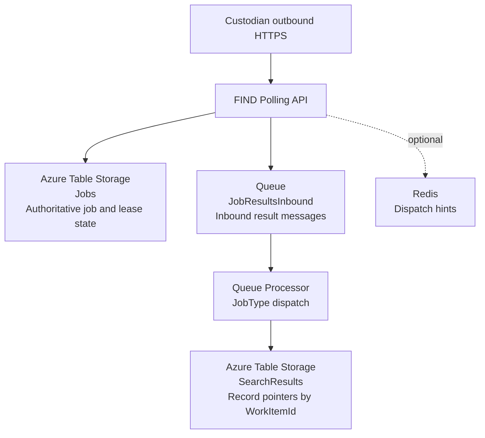

# ADR-SUI-0019: Job Broker and Lease State

Date: 17 February 2026  
Author: Simon Parsons  
Decision owners: SUI Service Team  
Category: Distributed discovery architecture (custodian integration)

---

## Status

Proposed

---

This ADR defines the lease strategy and job state.

References to Azure Table Storage in this document describe the current Discovery implementation used to validate the lease model under real contention and polling behaviour. They do not constitute a strategic or long-term datastore decision. The target Alpha storage strategy remains to be defined separately.

## Executive Summary

ADR-SUI-0018 defines how custodians poll FIND and claim work under a time-bound lease. This ADR defines the minimum infrastructure and storage model required to make that lease model correct, fast, and easy to operate during Discovery.

The Discovery implementation uses **Azure Table Storage as the single source of truth** for job state and lease state. The design intentionally avoids background sweepers and avoids write-heavy indexing. The aim is to keep Table Storage interactions minimal:

- **No-work poll:** one partition-scoped query returning `204`  
- **Successful claim:** one query + one conditional update  
- **Completion:** one conditional update  

Redis is **not** part of the Alpha baseline. It is explicitly deferred as an optional optimisation to suppress idle reads if telemetry proves it is needed.

This ADR covers broker/storage only. It does not redefine endpoint semantics (see ADR-SUI-0018).

---

## 1. Context

FIND implements a pull-based discovery model. Custodians poll FIND to claim work, perform local lookup, and submit results. The dominant cost driver in polling systems is usually the idle case (many polls returning “no work”). Therefore the Discovery design must keep both of these true:

1. **Correctness:** only one custodian can hold a lease for a given job at any moment.  
2. **Efficiency:** maintaining lease state must not be onerous; Table transactions must be minimised and access patterns must avoid scans.

This ADR assumes enterprise deployments behind proxies and load balancers, and standard HTTP client stacks.

---

## 2. Non-Negotiable Requirements

### 2.1 Core correctness rule

At any moment, a single job must be actively assigned (leased) to no more than one custodian.  

It must not be possible for two custodians to process the same job at the same time.

Where multiple custodians are required to carry out the same task, the task shall be represented by multiple independent jobs.

Competing claim attempts for the same job must result in exactly one successful claim and all other attempts being rejected in a deterministic manner.

### 2.2 Minimal state maintenance

The design must not depend on background maintenance processes to keep job state correct.

Specifically:

- When a lease expires, the job must automatically become eligible for re-claim based solely on its stored timestamps. No background task should be required to reset flags or update state.
- In the common “no work available” case, polling must require only a single read operation.
- Write operations must occur only when meaningful progress happens (job creation, successful claim, completion, or explicit lease renewal if enabled).

The system must avoid periodic sweepers, cleanup daemons, or repair jobs as part of normal operation.

### 2.3 Partition-scoped access patterns

When a custodian requests work, the system must be able to locate eligible jobs by querying only that custodian’s partition in Table Storage.

The design must avoid scanning the entire table across all custodians.

If one custodian generates significantly more traffic than others, the design must allow explicit scaling of partitions for that custodian. Any such scaling approach must be deliberate, observable, and operationally controlled.

---

## 3. Decision

The lease strategy defined below is the architectural decision captured by this ADR. The specific storage technology referenced reflects the current Discovery implementation and does not bind the programme to a long-term persistence platform.

### 3.1 Discovery implementation decision (non-strategic storage)

FIND SHALL store durable job metadata and lease state in **Azure Table Storage** using a single authoritative table (`Jobs`).

Leasing SHALL be represented as **lease overlay fields** (id/expiry). The lifecycle SHALL be represented using timestamps rather than state transitions.

All claim/complete transitions SHALL be enforced using optimistic concurrency (ETag + `If-Match`). Where two claimers race, one update succeeds and the other fails deterministically (`412 Precondition Failed`).

Azure Table Storage assigns an `ETag` to every entity version. When a job is read, its current `ETag` is returned. Claim and completion updates are performed using `If-Match` with that `ETag`, meaning the update will only succeed if the entity has not been modified since it was read. If another claimant updates the entity first, the `ETag` changes and the second update fails with `412 Precondition Failed`. This provides deterministic lease exclusivity without distributed locks.

Jobs older than a rolling 72 hour window SHALL be ignored for polling selection. Reinsertion or escalation of such jobs is treated as a separate operational concern outside this ADR.

### 3.2 Deferred optimisation

Redis was considered as a potential optimisation because polling systems are typically dominated by the idle case (high volumes of requests that return `204 No Content`). Even partition-scoped Table queries have a per-request cost and can become a throughput constraint if many custodians poll frequently.

A Redis layer could be used as a non-authoritative hint mechanism to suppress unnecessary Table reads when there is clearly no work, or to accelerate candidate selection when work is known to exist (for example by tracking a per-custodian “work available” flag or a small set of candidate JobIds). In all cases, the authoritative lease claim would still be enforced in Table Storage.

Redis is deferred in Discovery to avoid introducing additional operational surface area unless telemetry shows it is required.

---

## 4. Why Azure Table Storage for Discovery

Azure Table Storage is selected because it supports the Alpha requirements with minimal operational overhead:

- **Deterministic exclusivity without locks:** optimistic concurrency provides a clean “winner/loser” claim outcome under contention, avoiding distributed locks.  
- **Horizontal scalability aligned to access pattern:** Table Storage scales by partition. Because work is partitioned by custodian and polling is partition-scoped, the workload naturally aligns with the storage model and can scale out predictably.  
- **Cost model aligned to Alpha learning:** Table Storage is consumption-based and transaction-priced, with no database engine to provision or maintain. This keeps fixed costs low while allowing throughput to scale with demand.  
- **Low operational burden:** no database engine to patch/tune; capacity planning is simpler during Alpha learning.  
- **Entity-centric model fit:** the job and lease are naturally modelled as a single entity with atomic transitions.  
- **Minimal write amplification:** the baseline requires no additional index tables and no background maintenance tasks.

Table Storage is not chosen because it is universally best; it is chosen because it is sufficient for Alpha while keeping the architecture simple, economical, and defendable.

---

## 5. Why not Service Bus or a relational queue table for Discovery

### 5.1 Broker-first (Service Bus)

A broker provides built-in visibility locks and settlement semantics, which is attractive for competing consumers. However, it typically still requires a separate durable store for rich job metadata, correlation, attempts, and lease lifecycle diagnostics. That yields a two-system design at MVP and couples behaviour to broker semantics rather than a service-owned lease model.

This remains a viable future direction, but is not required to satisfy Alpha correctness.

### 5.2 Relational queue table (Postgres/SQL)

Relational queues provide strong transactional semantics and mature patterns. The trade-off is operational overhead and the need to manage contention, connection pooling, and database health. Alpha does not yet justify paying that cost unless telemetry forces it.

---

## 6. Storage Model

### 6.1 Table: `Jobs` 

One entity per job.

#### Keys

- `PartitionKey`: `custodianId`  
- `RowKey`: `{CreatedAtUtcTicks:D20}|{JobId}`

The `RowKey` embeds a monotonic time prefix to support stable “oldest-first” selection within a partition.

The `RowKey` begins with a fixed-width UTC ticks prefix. Because Azure Table Storage performs lexicographic comparisons on `RowKey` values, range queries using the ticks prefix (for example `RowKey >= "{windowStartTicks:D20}|"`) remain fully constrained by time. The `{JobId}` suffix does not affect the ability to bound scans by time; it exists only to guarantee uniqueness and stable ordering where multiple jobs share identical tick values.

#### Properties

| Property | Type | Meaning |
|---|---|---|
| JobId | string | The identifier of the job |
| JobType | string | The logical type of work (e.g. `CustodianLookup`, `ReindexRun`) |
| WorkItemType | string? | The category of higher-level work this job contributes to (e.g. `SearchExecution`) |
| WorkItemId | string? | Correlation identifier for aggregation across related jobs (e.g. a search execution id) |
| LeaseId | string? | Current lease identifier |
| LeaseExpiresAtUtc | datetime? | Lease expiry timestamp |
| AttemptCount | int | Number of times the job has been successfully claimed |
| CreatedAtUtc | datetime | Creation timestamp (UTC) |
| UpdatedAtUtc | datetime | Last mutation timestamp (UTC) |
| CompletedAtUtc | datetime? | When the job was confirmed as completed |
| PayloadJson | string | Serialised job payload |
| JobTraceParent | string? | Stored trace context seed |

The `Jobs` table is business-agnostic. “Search” is treated as one possible `WorkItemType`, rather than a first-class concern of the broker.

#### Core idea: visibility is time-based

A job is claimable when:

- `CompletedAtUtc` is null
- AND `AttemptCount < maxAttempts`
- AND (`LeaseExpiresAtUtc` is null OR `LeaseExpiresAtUtc < now`)

Jobs older than 72 hours are out of scope for polling selection. In Table Storage this is enforced by restricting the query to RowKeys within the 72 hour window (because RowKey is prefixed with creation ticks).

### 6.2 Queue: `JobResultsInbound` (ingress boundary)

Results submitted by custodians are **not** written directly to storage tables.

Instead, the submission endpoint SHALL:

1. Validate lease ownership (`LeaseId` matches and is not expired).
2. Perform minimal structural validation.
3. Enqueue a result message onto a durable queue (`JobResultsInbound`).

This ensures:

- The HTTP surface remains thin and fast.
- Result processing is decoupled from request handling.
- Downstream processing can scale independently.
- Transient storage or aggregation failures do not block custodians.

#### Message Shape (logical)

Each message SHALL include one or more record pointers returned by a custodian.

| Property | Meaning |
|---|---|
| JobId | The job the result relates to |
| JobType | Logical job type |
| WorkItemType | Higher-level work category (if any) |
| WorkItemId | Correlation identifier for aggregation (if any) |
| LeaseId | Lease under which the result was submitted |
| CustodianId | Submitting custodian |
| SubmittedAtUtc | Submission timestamp |
| Results | Collection of record pointers |

Each entry in `Results` SHALL include:

| Property | Meaning |
|---|---|
| SystemId | Custodian system identifier for the subject |
| RecordType | Logical record type (e.g. `ChildProtectionPlan`, `SEN`) |
| RecordUrl | URL from which the record can be retrieved |

The queue is durable. Messages are processed at-least-once.

Lease correctness is enforced before enqueueing. The queue processor does not re-evaluate lease validity.

### 6.3 Result Processing Model

A dedicated queue processor consumes messages from `JobResultsInbound`.

Processing behaviour is determined by `JobType`.

This keeps the broker generic and allows different job types to evolve independently.

#### Example: Search fan-out

Where:

- `WorkItemType = SearchExecution`
- `JobType = CustodianLookup`

The processor SHALL:

1. Persist one row per discovered record into a `SearchResults` table.
2. Use `PartitionKey = WorkItemId`.
3. Use `RowKey = {SubmittedAtUtcTicks:D20}|{custodianId}|{systemId}|{recordType}`.

This allows efficient aggregation of all discovered records for a single search execution across custodians, returned in chronological order.

#### Example: Other job types

For non-search jobs, the processor may:

- Update a domain table.
- Trigger downstream workflows.
- Emit events.
- Mark related entities complete.

The broker does not assume or enforce any particular post-processing behaviour beyond lease and completion semantics.

### 6.4 Table: `SearchResults`

This table is updated only for the **search fan-out** job type. It stores **record pointers** returned by custodians (system id, record type, and URL) and is optimised for assembling a single search response.

> Note: other job types MAY write to other domain tables. This ADR defines only the table required for search result aggregation.

#### Keys

- `PartitionKey`: `WorkItemId`
- `RowKey`: `{SubmittedAtUtcTicks:D20}|{custodianId}|{systemId}|{recordType}`

Placing the ticks prefix first ensures results are naturally returned in **chronological order** (oldest-first) within a search when scanning by `RowKey`.

The `{custodianId}|{systemId}|{recordType}` suffix provides stable ordering and reduces the chance of collisions if multiple records are submitted at the same tick.

#### Properties

| Property | Type | Meaning |
|---|---|---|
| CustodianId | string | Submitting custodian |
| SystemId | string | Custodian-local identifier for the subject |
| RecordType | string | Logical record type |
| RecordUrl | string | URL pointer to retrieve the record |
| SubmittedAtUtc | datetime | Submission timestamp |
| JobId | string | The job that produced this result (diagnostic / traceability) |

#### Idempotency and Duplicate Handling

Queue delivery is at-least-once. If the same result message is processed more than once, the ticks-prefixed `RowKey` MAY result in duplicate rows.

For Alpha, duplicates SHALL be tolerated and de-duplicated at read time using the tuple:

- `custodianId + systemId + recordType`

If duplicates are not acceptable, the `RowKey` SHALL be made deterministic (e.g. `{custodianId}|{systemId}|{recordType}` or `{JobId}|{systemId}|{recordType}`), at the cost of losing strict chronological ordering in key order.

### 6.5 Work Item Expected Job Count (Discovery Implementation)

Certain endpoints require the service to calculate the status of a WorkItem (for example, a search execution). 

Lease correctness alone does not provide sufficient information to determine overall completion. The service must also know how many jobs were created for the WorkItem.

To support this, the Discovery implementation SHALL persist the expected number of jobs created per WorkItem.

#### Table: `WorkItemJobCount`

One entity per WorkItem and JobType.

##### Keys

- `PartitionKey`: `WorkItemId`
- `RowKey`: `JobType`

##### Properties

| Property | Type | Meaning |
|---|---|---|
| ExpectedJobCount | int | Number of jobs created for this WorkItem and JobType |
| CreatedAtUtc | datetime | Timestamp of initial creation |
| UpdatedAtUtc | datetime | Last update timestamp |

This table is written at the time jobs are created for the WorkItem.

#### Status Derivation

WorkItem completeness SHALL be derived as:

1. `ExpectedJobCount` for a specific job (or sum of jobs) [Search] the WorkItem.
2. Count distinct `JobId` values written to `SearchResults` for the same `WorkItemId`.
3. Compute percentage completeness as unique jobs in search results as a percentage of total jobs
4. Status may be In Progress, Completed (when all job ids are in the Search Results), Expired when an acceptable period has been exceeded
---

#### Architectural Boundary

This mechanism:

- Does not participate in lease enforcement.
- Does not influence job eligibility.
- Exists solely to support status calculation endpoints.

## 7. Access Patterns and Transaction Counts

### 7.1 Enqueue a job (progress event)

**Transactions:** 1 write

Insert `Jobs` entity:

- `CreatedAtUtc = now`
- `AttemptCount = 0`
- Lease fields null

### 7.2 Poll / claim a job (progress event) (idle case bound)

**Idle case (no work)**  
**Transactions:** 1 query

Query within `custodianId` partition:

- Filter: `RowKey >= windowStartTicks`
- Order: by RowKey (natural)
- Page until the first eligible entity is found

The API SHALL apply a hard upper bound on the number of entities inspected per poll (to prevent unbounded partition scans). If no eligible job is found within the bound, the API SHALL respond `204` (or apply `Retry-After` as defined in ADR-SUI-0018).

**Successful claim**  
**Transactions:** 1 query + 1 conditional update

For the selected entity, attempt conditional update (`If-Match` ETag):

- `LeaseId = new GUID`
- `LeaseExpiresAtUtc = now + leaseDuration`
- `AttemptCount = AttemptCount + 1`
- `UpdatedAtUtc = now`

If conditional update fails (`412`), continue scanning for next eligible candidate (bounded by policy defined in ADR-SUI-0018).

### 7.3 Complete a job (progress event)

**Transactions:** 1 conditional update

- `CompletedAtUtc = now`
- `UpdatedAtUtc = now`

### 7.4 Renew a lease (optional)

**Transactions:** 1 conditional update

Renewal SHALL be performed using optimistic concurrency (`ETag` + `If-Match`) in the same manner as claim and completion updates.

The renew operation SHALL:

- Verify `LeaseId` matches the current entity value
- Extend `LeaseExpiresAtUtc`
- Update `UpdatedAtUtc`

If renew is not implemented, the job becomes eligible again after expiry (within the 72 hour window).

---

## 8. Partitioning Strategy

Azure Table throughput is partition-bound. The baseline uses one partition per custodian (`PartitionKey = custodianId`).

Further partitioning MAY be introduced later if telemetry indicates sustained partition throttling.

---

## 9. Backpressure, Idle Efficiency, and Why Redis is Deferred

In polling systems, the primary lever for idle efficiency is not storage choice; it is client behaviour (backoff) and server backpressure.

Discovery SHALL rely on:

- `204` responses when no work exists  
- `429` / `503` with `Retry-After` when throttling is required  
- mandatory client jitter/backoff (defined in ADR-SUI-0018)

Redis is deferred because introducing it by default increases operational surface area. If telemetry later shows that idle Table queries are too expensive, Redis can be introduced as a read-suppressing hint layer.

Even then, Table remains authoritative for claims.

---

## 10. Failure Modes

**Lease expiry**  
No action required. Eligibility returns automatically when `LeaseExpiresAtUtc < now` (subject to the 72 hour window).

**Concurrent claim attempts**  
Resolved deterministically by conditional update (`412` on loser). Correctness preserved.

**Stale jobs beyond window**  
Jobs older than 72 hours are not considered for polling. Operational reinsertion is external to this ADR.

**Table throttling**  
Surfaced through `429`/`503` and client backoff.

**Redis failure (if introduced later)**  
No correctness impact; system falls back to Table-only behaviour.

---

## 11. Comparative Summary

| Option | Correctness | Idle Efficiency | Operational Complexity | Fit for Discovery |
|---|---|---|---|---|
| Table-only (windowed selection) | ✅ Strong | ⚠️ Medium | ✅ Low | Recommended baseline |
| Table + Redis hints | ✅ Strong | ✅ High | ⚠️ Medium–High | Introduce only if needed |
| Service Bus + metadata store | ✅ Strong | ✅ High | ⚠️ Medium | Viable alternative model |
| Postgres/SQL queue table | ✅ Strong | ✅ High | ⚠️ Medium | Viable but heavier |

---

## 12. Consequences

### Positive

The Discovery implementation is simple, deterministic, and cheap to operate. Lease expiry requires no background maintenance, and Table transactions remain tightly bounded.

### Trade-offs

Performance is shaped by partition distribution and window size. Jobs older than 72 hours require separate operational handling if still required.

---

## 13. Diagram

