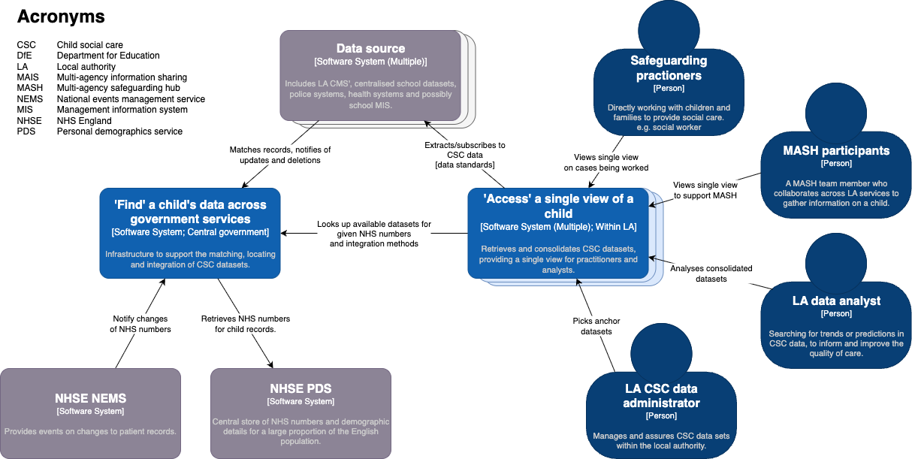
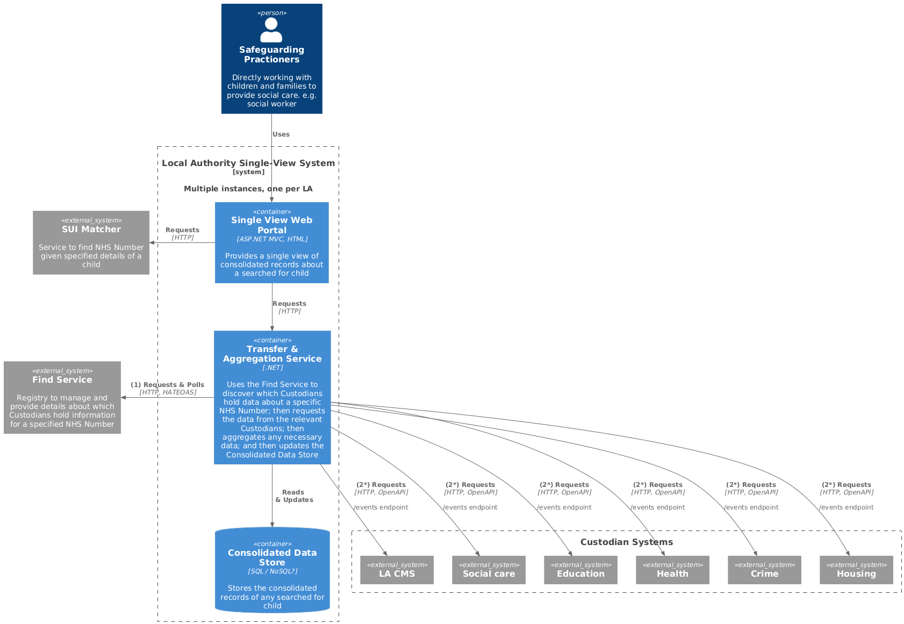
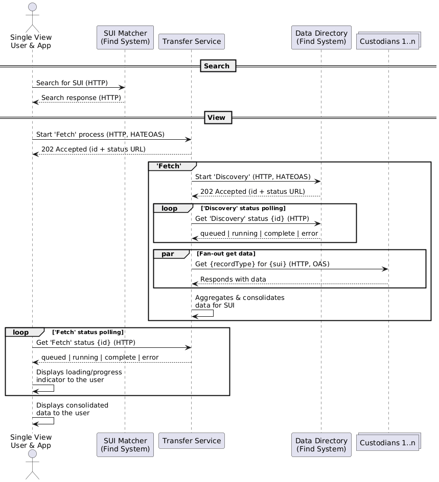

# Architecture models (C4 models)

## Repository Overview
'Single unique identifier' is a proposed set of systems and standards to
faciliate information sharing between child social care (CSC) systems.

This workspace/repository contains software that demonstrates the viability
of using the NHS number as the SUI and how data could be transferred between
data owners nationally, to present this data as a single view of a child for
the improved safeguarding of children.

## Document Overview

Providing logical and high-level infrastructure views on the single unique 
identifier systems.

See the [C4 model website](https://c4model.com/diagrams) for more details on 
the C4 modelling language.

## Early System context diagram

This System context diagram shows the early thinking around the single unique 
identifier systems.  Thinking has moved on, but this is still a very useful
diagram to explain the programme structure from a high level, and to document
the users of SUI, the acronyms, and the external systems.

## Transfer & View architecture

This Container diagram shows the current version of the architecture
model for the Transfer & View systems.

## Transfer & View sequence diagram

Although not a C4 model, the Transfer & View sequence diagram is useful to
explain the interactions between the systems and components.

