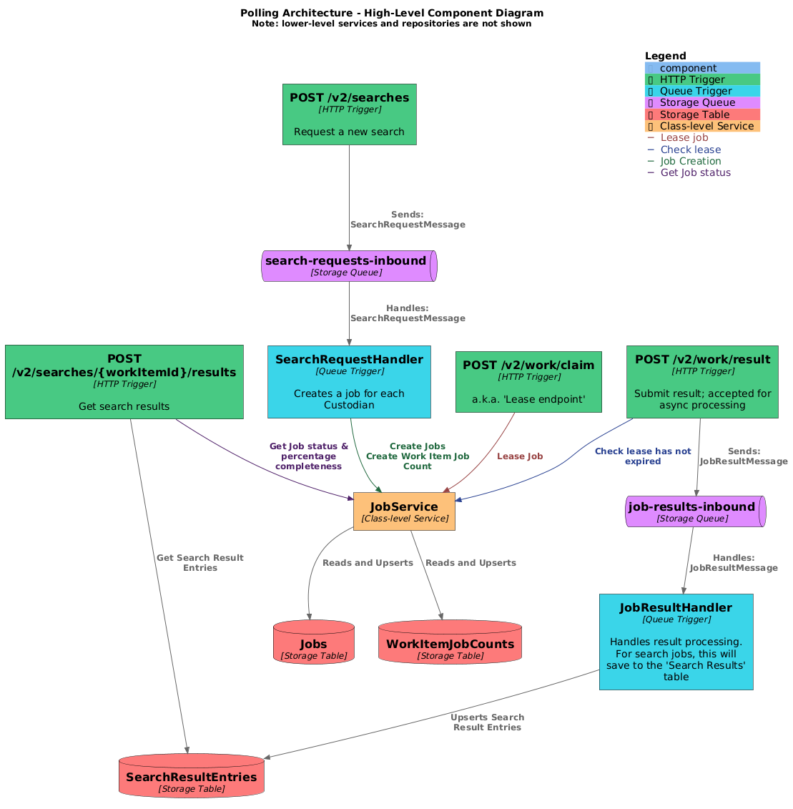
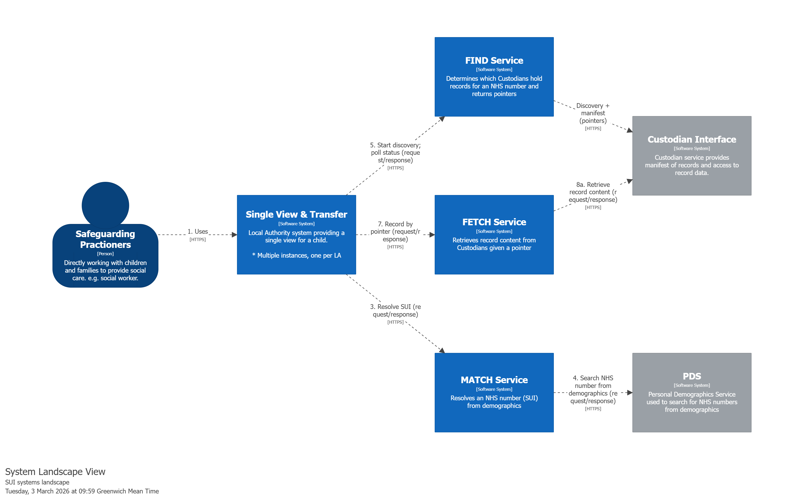
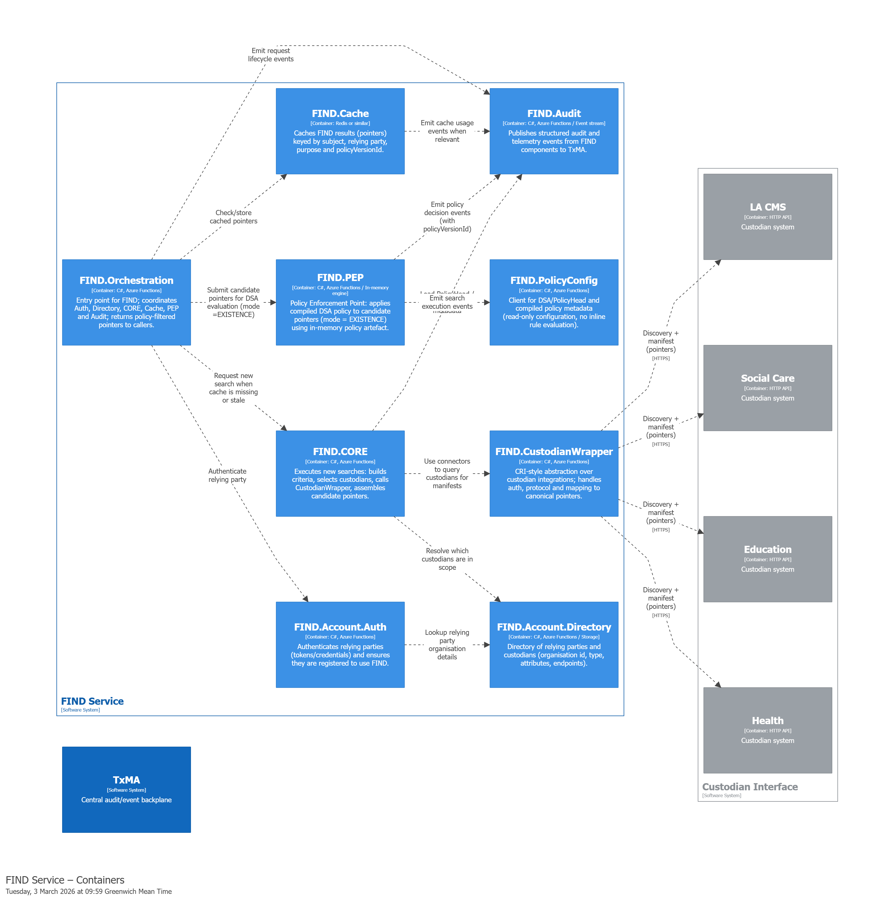
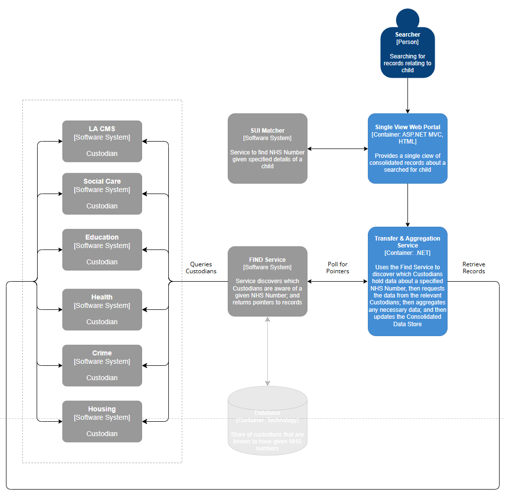
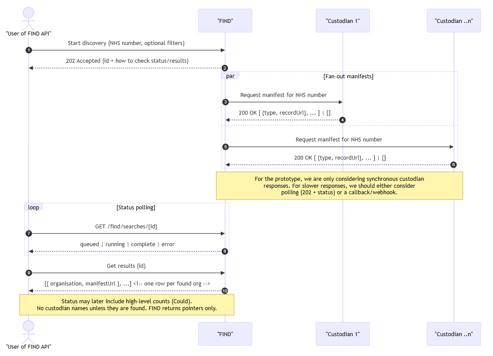
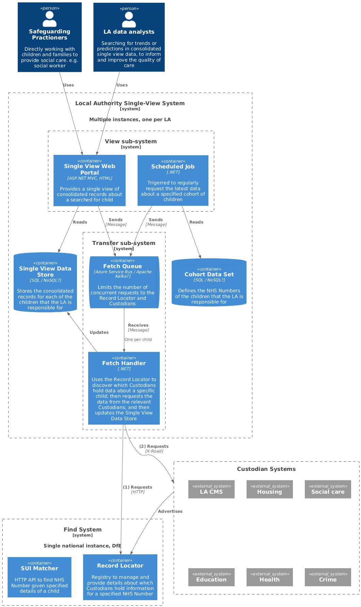

# Architecture models (C4 models)

## Repository Overview
This project investigates the technical foundations required to help practitioners improve safeguarding and welfare of children by accessing the right information at the right time, while maintaining strong standards of privacy, security, and data minimisation.

This project is in the Discovery Phase. This means everything in this repository should be considered exploratory, not production‑ready.

## Polling Architecture - High-Level Component Diagram

## Fan-out architecture models

Structurizr models for the Fan-out Architecture can be found in the [/Docs/Structurizr](../Structurizr/) directory ([Structurizr Readme](../Structurizr/README.md)).

The models are also shown here, for ease of access:

## Initial architecture models

The diagrams below provide the original logical and high-level infrastructure
views on the single unique identifier systems.

See the [C4 model website](https://c4model.com/diagrams) for more details on 
the C4 modelling language.

### Early System context diagram

This System context diagram shows the **early** thinking around the single unique 
identifier systems.  Thinking has moved on, but this is still a very useful
diagram to explain the programme structure from a high level, and to document
the users of SUI, the acronyms, and the external systems.

### Transfer & View architecture

This Container diagram shows the architecture model for the Transfer & View systems,
which are currently on-hold and not being actively developed.

### Transfer & View sequence diagram

Although not a C4 model, the Transfer & View sequence diagram is useful to
explain the interactions between the systems and components.

### Find-A-Record architecture

This Container diagram shows the thinking around the architecture model for
the Find system.

### Find-A-Record sequence diagram
The Find-A-Record sequence diagram is useful to explain the flow of the 'Find' process,
to find which Custodian's hold data about a specific single-unique-identifier.

### Transfer & View alternate architecture

This Container diagram shows the **early** thinking around the architecture
model for the Transfer & View systems, which includes the "preventive" use case
performed by the LA data analysts.

