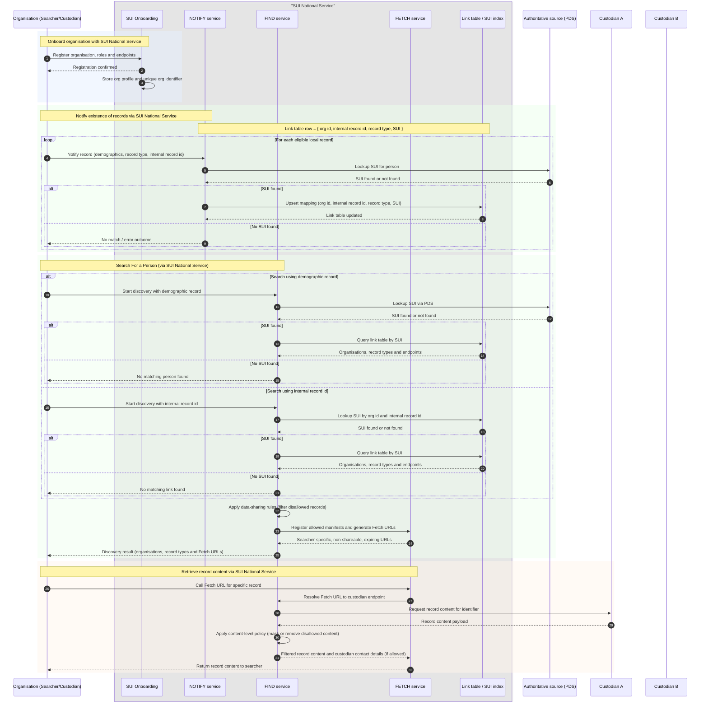

# Option A — Custodians Notify the Service of the Records They Hold (Central Link Table)

Option A provides a clear and simple approach in which custodians *tell* the SUI National Service about the records they hold, and the central service maintains a link table that records these associations.  
This allows the FIND service to determine which organisations hold records for a person **without needing to fan out queries** during a search, because the central service already knows who has notified data for that SUI.

### Enrolment

Organisations enrol with the SUI National Service, registering their endpoints and organisational details.  
No encryption keys are required under this model.

### Notifying the Existence of Records

Whenever a custodian creates or updates a record in their own system, they submit:

- A demographic record  
- Their internal record identifier  
- The type of record they hold  

The NOTIFY service resolves the demographic information via the Authoritative Source (PDS).  
If the demographic successfully resolves to an SUI (e.g., NHS number), a row is added to the central link table.

### Structure of the Link Table

Each row in the link table associates a custodian’s internal record with the SUI that person belongs to:

| Organisation Id | Record Type   | Record Id | SUI        |
|-----------------|---------------|-----------|------------|
| A               | Social Care   | XYZ123    | 0129384756 |
| B               | Crime         | 123123    | 0129384756 |
| C               | Housing       | ABCDEF    | 0129384756 |

Over time, this produces a complete picture of which organisations hold information about a given person.

### Searching for Records

Searchers can initiate a search in two ways:

#### 1. Search Using Demographic Data  
The FIND service uses the demographic record to obtain an SUI from PDS.  
Once the SUI is determined, the central link table is queried to locate all custodians who have previously notified data for that SUI.

#### 2. Search Using an Internal Record ID  
If the searcher already holds an internal record identifier for one of their own records, FIND can use that identifier to look up the SUI directly from the link table.  
This avoids the need for a demographic lookup.

### Manifest Generation and Retrieval

Once the SUI is known and the link table has been queried:

1. FIND identifies all custodians who hold relevant records.
2. Data Sharing Agreement (DSA) rules are applied to filter any records the searcher is not permitted to discover.
3. A manifest is generated, showing the allowed record types and custodian endpoints.
4. FETCH URLs are created to allow the searcher to retrieve record content securely.

Record retrieval through FETCH works in the same way as Option B: FIND mediates access to each custodian, applies policy-based filtering, and returns only the permitted content.

