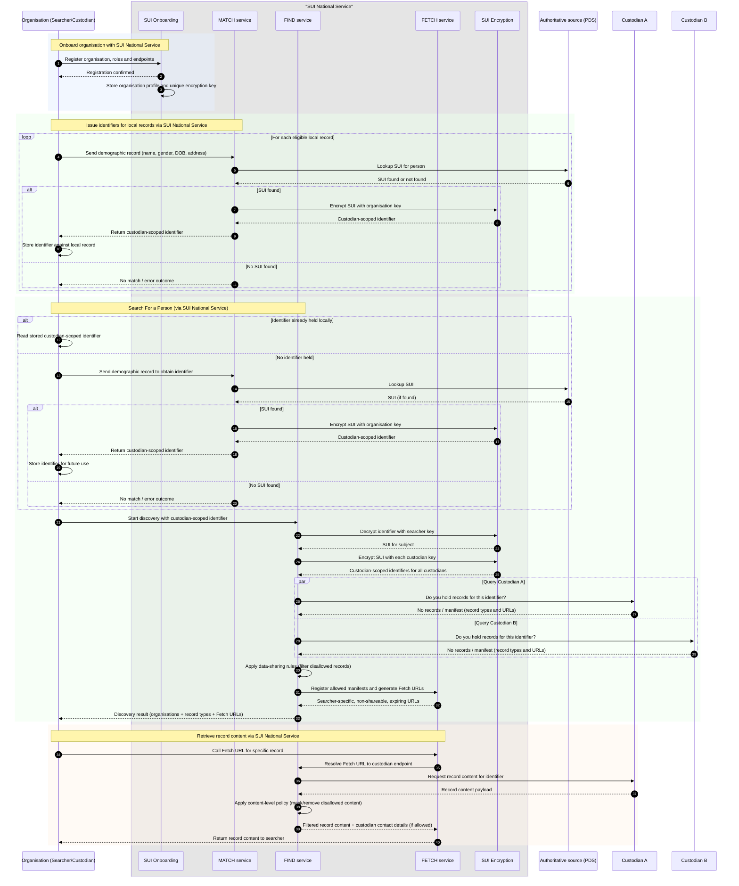

# Option B — Encrypted, Custodian-Scoped Identifiers Issued via the MATCH Service

In Option B, custodians do not handle the SUI (e.g., NHS number) directly.  
Instead, each custodian receives a **uniquely encrypted version** of the SUI that only the SUI National Service can translate.  
This allows organisations to reference the same individual across multiple systems **without ever exposing the underlying NHS number**, and without creating a universal token that could be correlated across domains.

## Enrolment and Key Allocation

When an organisation enrols with the SUI National Service, it is issued a **unique encryption key**.  
This key is never shared with any other organisation and is known only to the SUI Service itself.

## Obtaining an Identifier for Local Records

Custodians submit demographic records to the MATCH service to resolve a person’s identity.  
If a match is found via the Authoritative Source (PDS), the MATCH service:

1. Retrieves the SUI (e.g., NHS number)  
2. Encrypts it using *that custodian’s own key*  
3. Returns the resulting **custodian-scoped identifier**  

The custodian stores this encrypted identifier in their local database.  
They never store or see the SUI itself.

## Why Custodian-Scoped Encryption Matters

Because every custodian receives a **different encrypted representation** of the same SUI, the encrypted identifier:

- Cannot be correlated across organisations  
- Cannot be used as a cross-domain join key  
- Never becomes “sensitive” in the way a shared universal identifier would  

Even if a custodian widely reused or shared their local encrypted ID internally, it **would not behave like an NHS number** and would not increase linkage or privacy risk.  
Only the SUI National Service can translate between custodian-scoped identifiers.

## Searching for Records

A searcher initiates a search using *their own encrypted identifier* for a person.

The FIND service:

1. **Decrypts** the searcher’s identifier using the searcher’s key  
2. **Re-encrypts** the underlying SUI with every other custodian’s key  
3. Fans out queries to custodians using those custodian-specific encrypted values  

Each custodian can then determine whether they hold records for that person based on the identifier that *only they* can recognise.

## Discovery Results and Retrieval

Once custodians respond with either *“no records”* or a list of available record types, FIND:

- Applies DSA rules to filter out records the searcher is not permitted to discover  
- Constructs searcher-specific Fetch URLs  
- Returns a manifest showing which organisations hold which types of records  

The searcher then retrieves individual records from the FETCH service, which mediates access and applies any required content-level filtering or masking.

## Summary

Option B provides full cross-organisational discovery and record retrieval **without ever exposing the SUI**, and without the privacy or correlation risks associated with clear identifiers or shared tokens.  
The SUI is always encrypted in a custodian-specific way, and only the central service is able to translate between forms.

![Option B]](./option-b.svg)