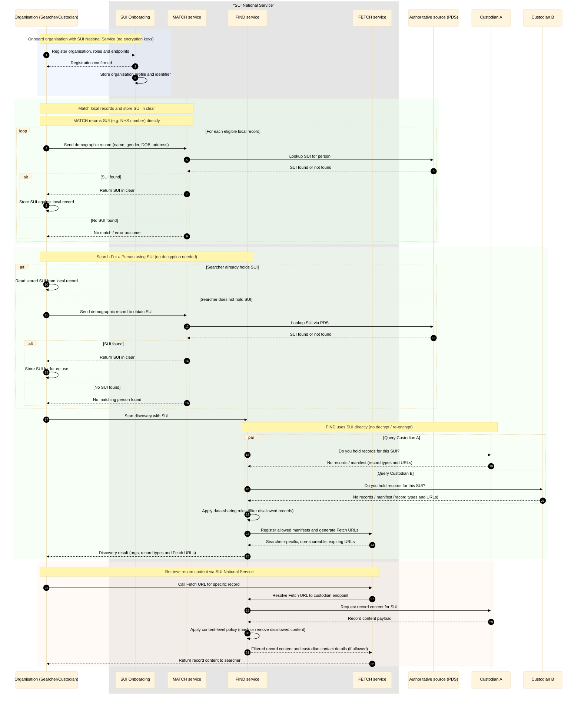

# Option C — SUI in the Clear

Option C operates in a very similar way to Option B, but without any encryption.  
Custodians work directly with the SUI (NHS number) rather than an encrypted identifier.

## Enrolment

Organisations still enrol with the SUI National Service, but no encryption key is allocated.

## Matching Records

Custodians continue to match their demographic records using the MATCH service, but instead of receiving an encrypted identifier, the MATCH service returns the SUI (NHS number) in the clear.

The custodian stores this SUI directly against their local person record in their own data store.

## Searching for a Person

When a searcher initiates a search, they do so using the SUI:

- If they already hold the SUI in their system, they pass it directly to the FIND service.
- If they do not hold the SUI, they can still obtain it by submitting a demographic record to the MATCH service.

Because the SUI is already provided in clear form, the FIND service does not need to decrypt anything.  
It simply uses the SUI as-is.

## Discovery

FIND fans out to all registered custodians to determine which organisations hold records for that SUI.  
Custodians respond with either:

- *No records found*, or  
- A manifest listing the record types they hold and the URLs for retrieving them.

FIND then:

1. Applies Data Sharing Agreement (DSA) rules to filter out any records that the searcher is not permitted to discover.
2. Wraps custodian endpoints behind searcher-specific Fetch URLs.
3. Returns the filtered manifest to the searcher.

## Fetching Records

The FETCH process is identical to Option B:

- The searcher calls the Fetch URL.
- FETCH resolves this to the custodian endpoint.
- The custodian returns the record content.
- FIND applies any content-level filtering required by policy.
- The filtered record is returned to the searcher.

The only material difference from Option B is the absence of encryption or decryption anywhere in the flow.

