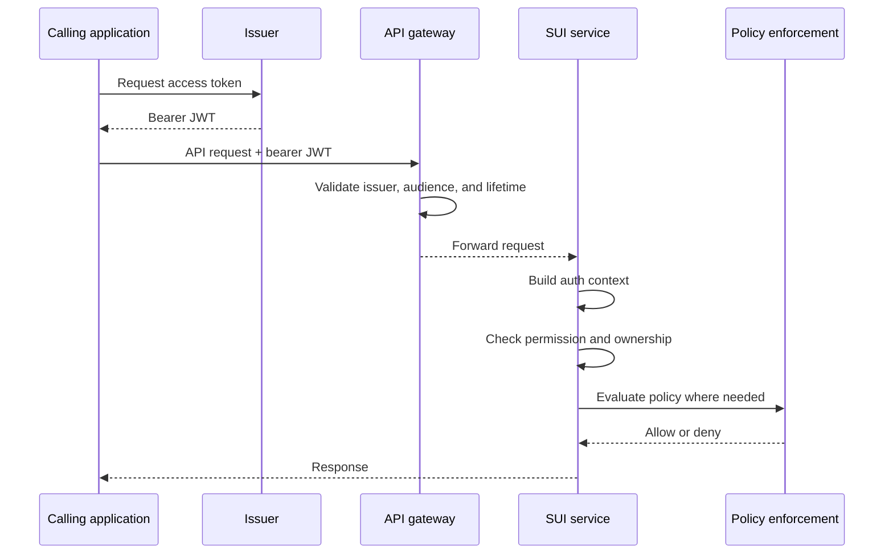

# Authentication Baseline and Security Model

**Date:** `2026-03-26`  
**Owner:** SUI Service Team  
**Scope:** Baseline authentication and security model for the active `MATCH` / `FIND` scope, the custodian polling flow, and the minimum `FETCH` support needed to preserve existing end-to-end flows.

This document builds on [Authentication and API Edge Strategy](./Index.md) and [ADR-SUI-0011: Authentication and trust boundaries for SUI APIs](../../Architecture%20decisions/Systems%20landscape/0011-authentication-and-trust-boundaries-for-sui-apis.md).

It defines the current baseline needed to guide implementation and follow-on design work.

---

## 1. Purpose

The purpose of this note is to make the current authentication direction concrete enough to support:

- implementation planning for the active service path
- a consistent application auth context across the services
- a clear split between gateway responsibilities and service responsibilities
- later refinement of environment, onboarding, and platform decisions

This note is a baseline, not a final end-state design.

---

## 2. Scope and Non-Goals

### 2.1 In scope

- organisation-level authentication for the active `MATCH` and `FIND` boundaries
- organisation-level authentication for custodian polling and work submission endpoints
- the minimum `FETCH` support needed to preserve existing end-to-end flows
- the baseline claims, permissions, and internal auth context needed by the services
- the minimum security checks expected at the gateway and in the application

### 2.2 Out of scope

- the final long-term issuer choice
- the final API edge choice
- the final onboarding portal or administrator experience
- final user-aware authentication or asserted user identity design
- detailed policy enforcement and Data Sharing Agreement enforcement logic
- the long-term `FETCH` model

### 2.3 Open assumptions

This baseline currently assumes:

- active inbound callers are organisation-managed workloads using machine credentials, not direct end users of the SUI service
- each inbound client or workload can be mapped to exactly one canonical `organisation_id` for the active service scope
- organisation-level identity is sufficient for the active `MATCH`, `FIND`, and custodian polling flows
- a single organisation may legitimately hold both searcher and custodian permissions at the same time
- at least one shared high-fidelity environment should use an `APIM`-shaped gateway model, but the application baseline must still work in cheaper dev/test and local or CI arrangements where JWT validation happens in the service itself
- policy and DSA decisions consume the auth outcome, but are not fully encoded in the auth baseline itself

---

## 3. Baseline Principles

The baseline model is built around the following principles:

- organisation-level machine-to-machine authentication is mandatory at the key service boundaries
- attended end-user authentication remains the responsibility of the consuming organisation and application
- a single organisation may act as a searcher, a custodian, or both
- authentication and policy enforcement are related but separate concerns
- the service should remain portable across more than one issuer or gateway option
- defence in depth should apply, with checks at both the gateway and application layers

This means the service should prove who the calling organisation/application is, what permissions it has, and whether it is allowed to call the operation. It should not treat authentication alone as sufficient for sensitive data disclosure decisions.

---

## 4. Baseline Boundary Model

### 4.1 End user -> Searcher application

End-user authentication happens in the consuming application and remains outside direct control of the SUI service.

The service baseline should therefore assume:

- a human user may or may not be known to the SUI service
- user authentication and local role-based access control are handled by the consuming organisation
- service-to-service operations must still work after the end user has left the flow

### 4.2 Searcher application -> SUI service

The searcher-side boundary must support unattended operation for:

- `MATCH`
- starting `FIND`
- polling `FIND` status
- retrieving `FIND` results
- minimal `FETCH` support where needed to preserve the current end-to-end path

The baseline at this boundary is:

- organisation-level machine authentication
- bearer access tokens
- operation-level permissions based on scopes or roles
- job and result access checks tied to the calling organisation

Current implementation note:

- the current `MATCH` endpoint also requires an `x-api-key` header in addition to bearer token authentication
- that extra API key gate is a current implementation detail, not part of the desired long-term baseline for this boundary

### 4.3 Custodian -> SUI service

The custodian-side boundary is always unattended.

The baseline at this boundary is:

- organisation-level machine authentication
- bearer access tokens
- permissions that allow polling, claiming work, and submitting results
- enforcement that a custodian can only act as itself and only on its own work

### 4.4 `FETCH`

`FETCH` is not the main focus of the active work, but the baseline needs to preserve the current end-to-end path.

For now, the baseline assumption is:

- `FETCH` remains minimally supported
- no expansion of the `FETCH` trust model is assumed in this note
- the long-term `FETCH` model remains a separate decision

---

## 5. Baseline Auth Context

The services should not operate directly on raw provider-specific token claims.

Instead, token validation should produce a normalised internal auth context containing at least:

- `organisation_id`
- `client_id`
- `permissions`
- `issuer`
- `subject`

The intent of these fields is:

| Field             | Purpose                                                    |
| ----------------- | ---------------------------------------------------------- |
| `organisation_id` | Canonical internal identifier for the calling organisation |
| `client_id`       | Identity of the calling application or workload            |
| `permissions`     | Normalised scopes or roles granted to the caller           |
| `issuer`          | Issuer identifier for audit and diagnostics                |
| `subject`         | Stable token subject for traceability                      |

The auth context may later grow to include asserted user context, but that is not part of the baseline.

### 5.1 Organisation identity

The baseline requirement is that the service must be able to derive a canonical `organisation_id` from trusted authentication data.

That does **not** require the raw token to contain an `organisation_id` claim in every environment.

The canonical organisation identity may be derived from:

- a dedicated organisation claim, where available, or
- another validated token claim such as `client_id` or `sub`, combined with a trusted server-side mapping to organisation identity

This allows the service to stay portable across issuers that expose slightly different claim shapes.

### 5.2 Claim inputs and derivation

The baseline requires the following identity and permission concerns to be available from the validated token or trusted server-side mapping:

| Concern                   | Acceptable baseline source                                               | Notes                                                                    |
| ------------------------- | ------------------------------------------------------------------------ | ------------------------------------------------------------------------ |
| Canonical organisation ID | `organisation_id` or equivalent org claim, or server-side client mapping | Must not come from request payload or caller-controlled headers          |
| Client or workload ID     | `client_id`; fallback `sub`                                              | Used for traceability and, where needed, organisation mapping            |
| Granted permissions       | preferably `scope` or `scp`; optionally `roles` or `role`                | Raw claim shape may vary by issuer; application code should normalise it |
| Issuer                    | `iss`                                                                    | Validated before the auth context is trusted                             |
| Audience                  | `aud`                                                                    | Validated before the auth context is trusted                             |
| Stable subject            | `sub`                                                                    | Retained for audit and diagnostics even when `client_id` is also present |

The baseline therefore requires these concerns to be derivable, but does **not** require every environment to use exactly the same raw claim names.

For clarity:

- the standard external OAuth expression of API capability should be treated as `scope`
- the internal `permissions` field in the auth context is a normalised application concept, not a requirement for a token claim literally named `permissions`
- role claims may supplement scopes where an issuer exposes them, but the baseline should not depend on a non-standard `permissions` token claim

### 5.3 Current implementation gap

The current `Find` implementation uses an auth context that contains only:

- `ClientId`
- `Scopes`

The current middleware already tolerates several raw permission claim shapes, but the resulting auth context still collapses them down to `ClientId` and `Scopes`.

In the current prototype, `ClientId` is also used as the effective organisation key across the application layer. Search ownership, policy context, encryption lookup, and custodian job routing all currently depend on that direct value rather than on a separate canonical `organisation_id`.

There is not yet a separate abstraction that maps validated client identity to canonical organisation identity before business logic runs.

That is useful as a prototype, but it is not sufficient as the longer-term baseline because it does not make canonical organisation identity explicit.

---

## 6. Baseline Permission Model

The current working permission model should stay close to the active implementation unless there is a clear reason to rename it.

This keeps the baseline practical while leaving room to refine naming later.

### 6.1 Baseline roles

For the active scope, roles are a high-level authorisation concept, not separate top-level organisation identities.

| Baseline role | Meaning in this note                                                             | How it is derived in the baseline                               |
| ------------- | -------------------------------------------------------------------------------- | --------------------------------------------------------------- |
| Searcher      | An organisation calling `MATCH`, `FIND`, or minimal `FETCH` endpoints            | Caller holds one or more searcher-side permissions              |
| Custodian     | An organisation polling for work, claiming work, or submitting work item results | Caller holds one or more custodian-side permissions             |
| Dual-role org | A single organisation that can legitimately perform both kinds of interaction    | Caller holds both permission sets; no separate top-level org ID |

The baseline does **not** require a dedicated token role claim for `searcher` or `custodian`.

If an issuer exposes role claims, they should be mapped into the same internal permission model rather than treated as a separate source of truth.

### 6.2 Searcher-side permissions

| Operation             | Baseline permission |
| --------------------- | ------------------- |
| Match a person        | `match-record.read` |
| Start a search        | `find-record.write` |
| Cancel a search       | `find-record.write` |
| Read search status    | `find-record.read`  |
| Read search results   | `find-record.read`  |
| Minimal fetch support | `fetch-record.read` |

### 6.3 Custodian-side permissions

| Operation                       | Baseline permission |
| ------------------------------- | ------------------- |
| Check whether work is available | `work-item.read`    |
| Claim work                      | `work-item.write`   |
| Submit work item results        | `work-item.write`   |

### 6.4 Notes on permission naming

The current permission names should be treated as a working baseline, not as a final taxonomy.

They may later be renamed if the team decides that a different naming scheme is clearer or better aligned with the final service shape.

For the active baseline, these permissions are best treated as OAuth scopes at the API boundary.

That means names such as `find-record.read` and `work-item.write` should normally appear in the token's `scope` or `scp` representation, then be mapped into the application's internal `permissions` model.

---

## 7. Baseline Token Model

The baseline token model is:

- `OAuth 2.0 client_credentials`
- bearer `JWT` access tokens
- short-lived access tokens
- no dependency on end-user presence

For the active baseline, the likely near-term practical client authentication method is:

- `client secret`

That should not be treated as a permanent constraint. The baseline should still leave room for stronger client authentication methods, such as certificates, if later governance or security requirements demand them.

The service should be able to validate the following token concerns regardless of issuer:

| Concern         | Baseline expectation                                |
| --------------- | --------------------------------------------------- |
| Issuer          | Trusted and expected                                |
| Audience        | Matches the target service                          |
| Lifetime        | Token is not expired and is valid for current use   |
| Client identity | A stable client/application identity can be derived |
| Permissions     | Required scopes or roles can be derived             |

The service should accept more than one claim shape where that is needed for portability, provided the claims are mapped into the normalised internal auth context.

Current implementation note:

- the current prototype validates a single configured issuer, audience, and signing key
- sandbox-issued tokens currently contain `client_id` and `scp`; they do not emit a separate `organisation_id`
- multi-issuer support and a separate client-to-organisation mapping layer are baseline goals, not current implemented behaviour

---

## 8. Enforcement Model

### 8.1 Gateway responsibilities

Where an API gateway is present, the baseline expectation is that it should handle coarse security checks such as:

- token signature validation
- issuer validation
- audience validation
- token lifetime checks
- coarse permission gating where practical
- rate limiting and other edge protections

These checks are helpful, but they are not sufficient on their own.

### 8.2 Application responsibilities

The application should still enforce the security model itself.

At a minimum, the service should:

- validate or trust only already-validated tokens from an expected path
- build the normalised auth context
- check the required permission for the operation
- enforce organisation-to-resource ownership rules
- ensure that searchers cannot use custodian endpoints and custodians cannot use searcher endpoints unless explicitly permitted
- apply policy enforcement separately where the operation requires it
- emit audit and correlation information using the normalised auth context

Current implementation note:

- the current application always validates bearer JWTs in `JwtAuthMiddleware`
- a separate trust mode based on gateway-forwarded auth context is not implemented yet

### 8.3 Resource ownership checks

The baseline model requires explicit ownership checks for resources such as:

- search jobs
- search results
- work items

Examples:

- a searcher should only be able to read or cancel searches owned by its organisation unless a later design explicitly allows otherwise
- a custodian should only be able to claim or complete work that is assigned to that custodian organisation
- requests must not rely on client-supplied organisation identifiers where the caller identity can be derived from the token

---

## 9. Relationship to Policy Enforcement

Authentication and policy enforcement should not be conflated.

The baseline auth model answers questions such as:

- which organisation is calling?
- which application or workload is calling?
- what operations is it allowed to attempt?

Policy enforcement answers different questions such as:

- whether this organisation is entitled to see that result
- whether the requested use is allowed for the current purpose
- whether record existence or content may be disclosed

The auth baseline should therefore feed policy enforcement, not replace it.

---

## 10. Open Points Carried Forward

This baseline deliberately leaves several points open:

- whether user-aware auth is needed for any operations
- whether `organisation_id` should eventually come from a dedicated token claim everywhere
- whether the current permission names should be renamed
- the final issuer and gateway choice
- the long-term `FETCH` model

These points should not block adoption of the baseline unless they directly affect the active implementation path.

---

## 11. Immediate Implementation Implications

If this baseline is adopted, the main implications for implementation are:

- the auth context should evolve beyond `ClientId` and `Scopes`
- canonical organisation identity should become explicit in the application layer
- endpoint permissions should be documented and enforced consistently
- search and work-item ownership checks should be explicit
- token-to-auth-context mapping should be abstract enough to support more than one issuer
- minimal `FETCH` support can remain, but should not drive the baseline design

### 11.1 Follow-on implementation ticket themes

The baseline should be concrete enough to seed implementation tickets such as:

- extend the inbound auth context to carry canonical `organisation_id`, `client_id`, `permissions`, `issuer`, and `subject`
- introduce a token-to-auth-context mapper that supports the accepted claim shapes and trusted organisation mapping
- update `MATCH`, `FIND`, polling, and minimal `FETCH` endpoints so required permissions are explicit and consistently enforced
- replace ownership checks that rely only on `ClientId` with checks against canonical organisation ownership
- enforce searcher versus custodian endpoint separation in the application layer, not only at the gateway
- emit audit and diagnostic data using the normalised auth context so auth decisions are traceable across services

---

## 12. Relationship to Later Work

This note is intended to support:

- environment strategy work
- implementation hardening work in the active services
- onboarding and governance work
- later architecture decision records, if and when decisions become firm
