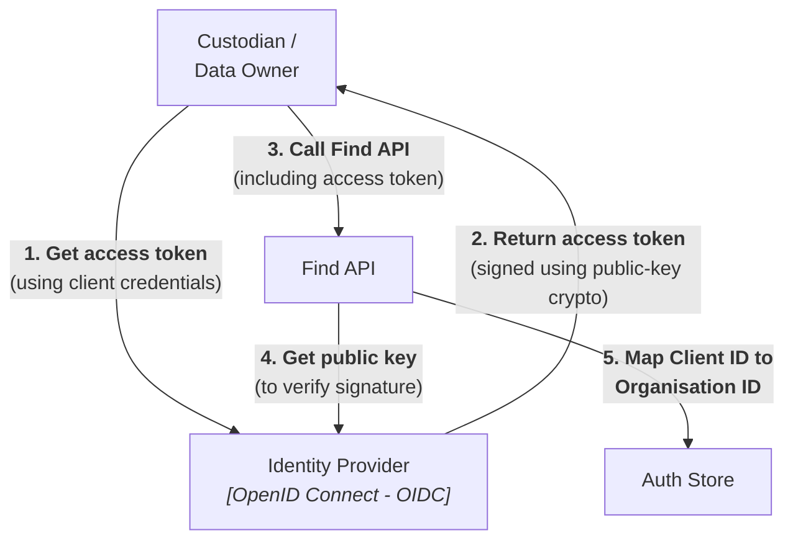
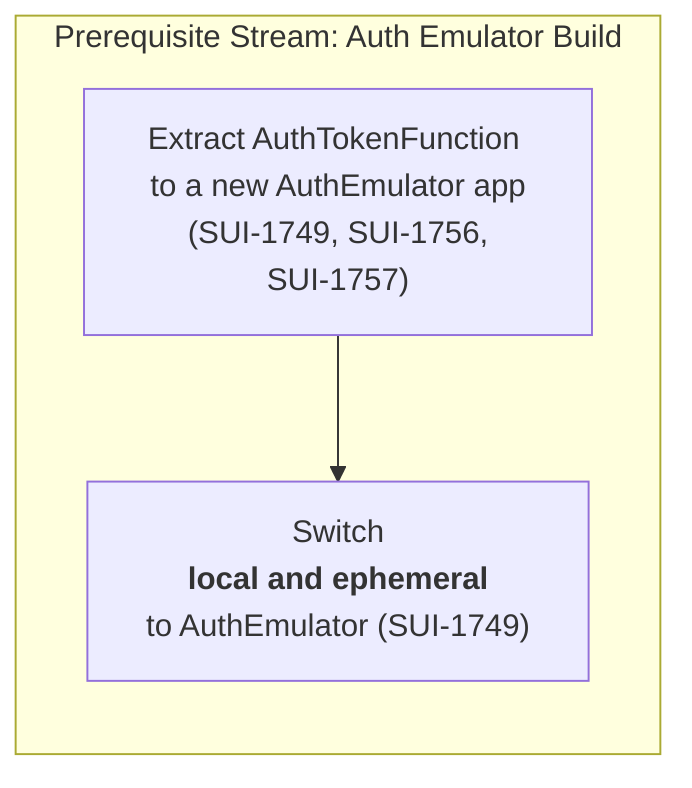
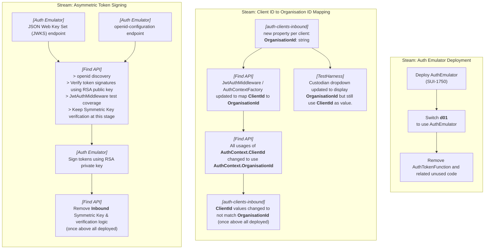

# Generic OAuth2/JWT Auth Model

**Date:** `2026-05-18`  
**Owner:** SUI Service Team  
**Scope:** Target authentication model for local, CI, ephemeral, non-prod, and high-fidelity environments; for MATCH, FIND and any minimal FETCH maintenance needed to preserve existing E2E and Test Harness flows.

This document builds on:
* [Authentication and API Edge Strategy](./Index.md),
* [Authentication Baseline and Security Model](./BaselineSecurityModel.md),
* [Authentication Environment Strategy](./EnvironmentStrategy.md), and
* [ADR-SUI-0011: Authentication and trust boundaries for SUI APIs](../../Architecture%20decisions/Systems%20landscape/0011-authentication-and-trust-boundaries-for-sui-apis.md).


## 1. Purpose

The purpose of this design note is to capture the gaps in the current prototype-only auth and specify the changes required to evolve the auth toward a generic OAuth2 / JWT model.

This document outlines the technical specifications required to start development of the generic auth.


## 2. Current auth gaps and prototype-only decoupling

The gaps in the current auth implementation, and the elements to decouple from the prototype-only auth, are:

* Asymmetric signature signing and verification is needed.
    - To move to secure industry best practices whereby private keys are not shared, enabling integration with 3rd party identity providers.

* Find API's authentication needs to be driven by standard OIDC inputs inputs/configuration.
    - To enable Find API to integrate with 3rd party identity providers, rather than being tightly coupled to its current emulated auth.

* The token verification in Find API needs full integration test coverage.
    - To verify that system is secure.

* The eumlated auth token endpoint needs to be decoupled from Find API.
    - To remove the coupling with the emulated auth.

* Canonical Oganisation IDs need be decoupled from token identity (Client IDs).
     - To enable Find API to integrate with 3rd party identity providers, so that token identity / Client IDs can be mapped to canonical Oganisation IDs.

* Client secrets are contained in the public repository.
    - While having client secrets in a public repo is fine for local development and ephemeral environments, deployed environments should use actual secret values (rather than pretend secret values that have been publicly published) so that unauthorised people cannot authenticate with our deployed environments.


## 3. Assumptions

* The identity provider used in alpha (and possibly beyond) will likely use RSA 256-bit (RS256) asymmetric encryption.

* Improved and more secure signing algorithms will be added later, for example Elliptic Curve Digital Signature Algorithm (ECDSA) and Edwards-curve Digital Signature Algorithm (Ed25519).


## 4. Target Auth Model



## 5. Impacted Functionality

### Inbound Auth - Custodians calling MATCH and FIND

#### Asymmetric Token Signing change

The endpoints affected by the change to use asymmetric (public-private key) cryptography are:
* `CancelSearchFunction` (`find-record.write`)
* `ClaimJobFunction` (`work-item.write`)
* `FetchRecordFunction` (`fetch-record.read`)
* `MatchFunction` (`match-record.read`)
* `RenewLeaseFunction` (`work-item.write`)
* `SearchFunction` (`find-record.write`)
* `SearchFunctionV2` (`find-record.write`)
* `SearchResultsFunction` (`find-record.read`)
* `SearchResultsV2Function` (`find-record.read`)
* `SearchStatusFunction` (`find-record.read`)
* `SubmitJobResultsFunction` (`work-item.write`)
* `WorkAvailableFunction` (`work-item.read`)

> Note that all the endpoints listed above use the existing `JwtAuthMiddleware`.  The desired and recommended approach is to update the `JwtAuthMiddleware` so that all the affected endpoints will be updated in one go.

#### Client ID to Organisation ID change

The items of functionality impacted by the "Client ID to Organisation ID mapping" change are:

* `CancelSearchFunction`
* `ClaimJobFunction`
* `FetchRecordFunction`
* `MatchFunction`
* `RenewLeaseFunction`
* `SearchFunction`
* `SearchFunctionV2`
* `SearchResultsFunction`
* `SearchResultsV2Function`
* `SearchStatusFunction`
* `SubmitJobResultsFunction`
* `WorkAvailableFunction`
* `AuditMiddleware`

#### Use Non-public Client IDs and Secrets change

The `auth-clients-inbound.json` data file is affected by the change to use non-public Client IDs and non-public Client Secrets when running in deployed environments.

### Outbound Auth - FIND (Fanout only) and FETCH calling Custodians

#### Asymmetric Token Signing Change

The `OutboundAuthService` (and `auth-clients-outbound.json`) should not be modified by the move to asymmetric (public-private key) cryptography.  The `OutboundAuthService` should remain using its existing symmetric (private key) cryptography.  This is the service that deals with `SUI service -> Custodian` calls:
* Fanout (query providers)
* FETCH's `SUI service -> Custodian` call to get the record data (`FetchRecordService`)

It is important to note that the `Custodian -> SUI service` part of FETCH **is in scope**, and coverred by the asymmetric (public-private key) update to `FetchRecordFunction`.

#### Client ID to Organisation ID Change

The `OutboundAuthService` should not be modified by the "Client ID to Organisation ID Mapping" change.

#### Use Non-public Client IDs and Secrets change

The `auth-clients-outbound.json` data file is affected by the change to use non-public Client IDs and non-public Client Secrets when running in deployed environments.

## 6. Implementation Work

### Work Streams

To avoid a big bang change, and enable changes to be done in parallel without any breaking changes, the following work streams have been devised:

rs-todo: create tickets and include Jira IDs  

rs-todo: update SUI-1753, ICustodianService should just have an ICustodianService.GetAuthorisedScopes(orgId) method
    ^^^^ maybe jst abandon this actually, in favour of the new plan?
	rather than HasAnyRequiredScopeAsync
	that logic should remain in JwtAuthMiddleware
	And so the update to JwtAuthMiddleware, if UseCustodianServiceForAuthorisation is true, just does something like:
		HasAnyRequiredScope:
			var authorisedScopes = ICustodianService.GetAuthorisedScopes(orgId)
			requiredScopes.Any(rs =>
				authorisedScopes.Contains(rs, StringComparer.OrdinalIgnoreCase)
			);
			i.e. should return true if the Organisation with the specified ID has any of the specified required scopes.  

rs-todo: me to do quickly, at end of this, a quick LINQPad that verifies a FaUAPI token, using OIDC discovery

#### Prerequisite Stream



★ This **Auth Emulator Build** work stream should be completed as a prerequisite before the other streams, so that the further changes required to the emulated auth (e.g. Asymmetric Token Signing change) are completed in the new separated app, and so that less code needs to moved across and deleted.

#### Main Streams



★ Once the **above** main streams of development work are complete, the final tidy up and verification work **below** can commence.

#### Follow On Streams

```mermaid
flowchart
    subgraph Verify ["Stream: Verify Generic Auth Model"]
        direction TB

        subgraph hideDeployedClientSecretsContainer [" "]
            direction TB

            hideDeployedClientSecrets["Change deployed environments to use Non-public Client IDs and Secrets"]

            auth-clients-inbound.json

            auth-clients-outbound.json

            hideDeployedClientSecrets --> auth-clients-inbound.json

            hideDeployedClientSecrets --> auth-clients-outbound.json
        end

        verifyUsingFaUAPI["Verify Generic OAuth2/JWT Auth Model by integrating a new deployed Sandbox environment with Find and Use an API (FaUAPI)"]

        hideDeployedClientSecretsContainer --> verifyUsingFaUAPI
    end

    subgraph Test ["Stream: Expand E2E/Integration Test"]
        direction TB

        addOrganisations["`Add new Organisations with less allowed scopes
            (e.g. searcher-only, custodian-only)`"]

        allowedScopesVerification["Expand E2E/Integration Tests to cover allowed scopes verification"]

        addOrganisations --> allowedScopesVerification
    end
