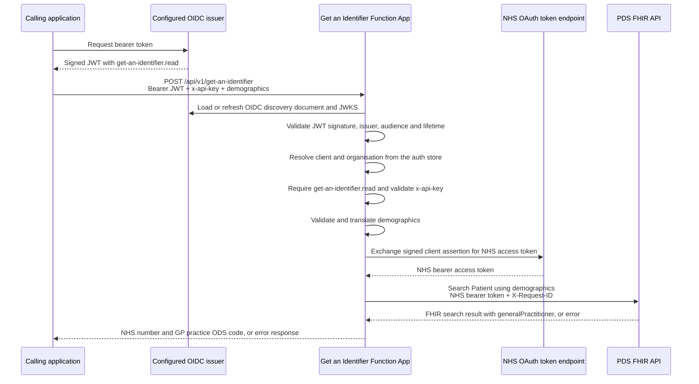

# Get an Identifier: as-built design

**Last checked:** `2026-08-26`

**Status:** Implemented behaviour on `main`

This page describes the current Get an Identifier request path. It is deliberately narrower than the proposed SUI architecture and should be updated when the implementation changes.

## Current request path

The application validates JWTs itself using the configured OIDC discovery document. AuthEmulator supplies this contract for local development. Integration with FaUAPI is separate planned work and is not represented as implemented here.

The operation currently requires both:

- a bearer JWT with the `get-an-identifier.read` scope
- the configured `x-api-key`

The Function App uses `AuthorizationLevel.Anonymous` because these checks are performed in application code rather than by an Azure Functions host key.

## Match response

A successful match returns the NHS number as `PersonId` and `GeneralPractitioner` as a collection containing the ODS code from the PDS FHIR `Patient.generalPractitioner` field. The collection is empty when PDS does not supply a registered practice, including for records where location-sensitive fields are withheld.

Get an Identifier does not call the Organisation Data Service FHIR API or enrich the ODS code with practice details.

## Configuration boundaries

Inbound authentication is provider-neutral and configured through `AuthSettings`:

- `Issuer`
- `Audience`
- `OidcDiscoveryUrl`
- `AccessTokenUrl`, which is present in configuration but is not currently consumed by the request path
- `UseAuthStoreForAuthorisation`

After validating a token, the current `AuthContextFactory` always resolves its client and organisation against the bundled auth store. `UseAuthStoreForAuthorisation` controls whether permissions come from that store or from token scopes; it does not disable the client lookup.

The application reads NHS OAuth and PDS configuration through `NhsAuthConfig`. The private key, key identifier, NHS client ID and Get an Identifier API key are supplied to deployed environments through Key Vault references.

The runtime-generated API description is available from `/api/openapi/v3.json`, with Swagger UI at `/api/swagger/ui`. It does not currently declare the bearer-token and API-key security requirements, even though the operation enforces both at runtime.

## Request metadata

The request contract currently accepts optional metadata containing `RecordType`, `SystemId` and `RecordId`. `RecordType` is validated when metadata is supplied, but the metadata is not passed to the matching service, persisted or used in the PDS request.

Metadata-driven identifier/custodian association and lifecycle behaviour is therefore **not implemented**. The metadata fields should not be interpreted as proof that those wider behaviours exist.

## Proposed functionality not in the current service

The following capabilities appear in discovery documents or draft ADRs but are not implemented by Get an Identifier:

- MNS/NEMS subscriptions and processing of PDS record-change events
- persistence of identifier-to-custodian associations
- registration, signing, queuing or delivery of webhooks
- lifecycle notification and remediation flows
- the wider polling-based `FIND`, `FETCH`, jobs and results architecture

The relevant documents retain value as proposed or historical design material, but their status must be checked before using them as implementation guidance. In particular, the [notifications and webhooks design](../Notifications-Webhooks/Index.md) is explicitly proposed, and the [MNS architecture decision](../../Architecture%20decisions/Systems%20landscape/0014-demographic-event-integration-nems-mns.md) remains a draft work in progress.
