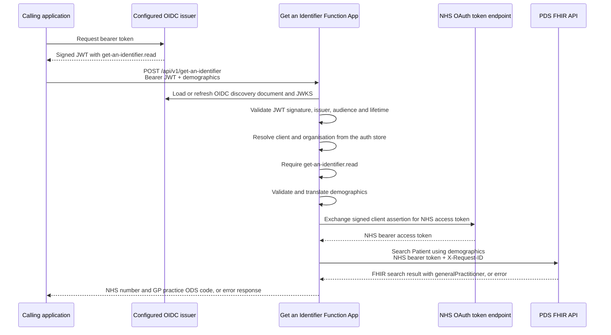

# Get an Identifier: as-built design

**Last checked:** `2026-09-30`

**Status:** Implemented behaviour on `main`

This page describes the current Get an Identifier request path. It is deliberately narrower than the proposed SUI architecture and should be updated when the implementation changes.

## Current request path

```mermaid
sequenceDiagram
    participant Caller as Calling application
    participant Issuer as Configured OIDC issuer
    participant Function as Get an Identifier Function App
    participant NHSAuth as NHS OAuth token endpoint
    participant PDS as PDS FHIR API

    Caller->>Issuer: Request bearer token
    Issuer-->>Caller: Signed JWT with get-an-identifier.read
    Caller->>Function: POST /api/v1/get-an-identifier<br/>Bearer JWT + demographics
    Function->>Issuer: Load or refresh OIDC discovery document and JWKS
    Function->>Function: Validate JWT signature, issuer, audience and lifetime
    Function->>Function: Resolve client and organisation from the auth store
    Function->>Function: Require get-an-identifier.read
    Function->>Function: Validate and translate demographics
    Function->>NHSAuth: Exchange signed client assertion for NHS access token
    NHSAuth-->>Function: NHS bearer access token
    Function->>PDS: Search Patient using demographics<br/>NHS bearer token + X-Request-ID
    PDS-->>Function: FHIR search result with generalPractitioner, or error
    Function-->>Caller: NHS number and GP practice ODS code, or error response
```

The application validates JWTs itself using the configured OIDC discovery document. AuthEmulator supplies this contract for local development. Integration with FaUAPI is separate planned work and is not represented as implemented here.

The operation requires a valid bearer JWT and the `get-an-identifier.read` permission. Permissions are resolved from the configured auth store or token scopes according to `AuthSettings:UseAuthStoreForAuthorisation`.

The Function App uses `AuthorizationLevel.Anonymous` because these checks are performed in application code rather than by an Azure Functions host key.

## Match response

A successful match returns the NHS number as `PersonId` and `GeneralPractitioner` as a collection containing the ODS code from the PDS FHIR `Patient.generalPractitioner` field. The collection is empty when PDS does not supply a registered practice, including for records where location-sensitive fields are withheld.

Get an Identifier does not call the Organisation Data Service FHIR API or enrich the ODS code with practice details.

## Configuration boundaries

Inbound authentication is provider-neutral and configured through `AuthSettings`:

- `Issuer`
- `Audience`
- `OidcDiscoveryUrl`
- `AccessTokenUrl`, which is present in configuration but is not currently consumed by the request path
- `UseAuthStoreForAuthorisation`

After validating a token, the current `AuthContextFactory` always resolves its client and organisation against the bundled auth store. `UseAuthStoreForAuthorisation` controls whether permissions come from that store or from token scopes; it does not disable the client lookup.

The application reads NHS OAuth and PDS configuration through `NhsAuthConfig`. The private key, key identifier and NHS client ID are supplied to deployed environments through Key Vault references.

The runtime-generated API description is available from `/api/openapi/v3.json`, with Swagger UI at `/api/swagger/ui`. The operation declares an OAuth2 client-credentials security scheme. At runtime, the operation requires a valid bearer JWT and the `get-an-identifier.read` permission.

## Alpha direction and implementation boundaries

Get an Identifier is the main vendor-facing API for Alpha. The agreed direction extends matching with MNS subscriptions for matched people. Relevant lifecycle changes are to be received through MESH by the separate Notification Service, which will notify registered supplier webhook endpoints. Suppliers then rematch affected records through Get an Identifier; webhook notifications do not return replacement NHS numbers, GP details or demographics.

The current Get an Identifier request path stops after PDS matching and returning the response. It does not create MNS subscriptions, maintain identifier-to-custodian associations, or register or deliver webhooks.

The accepted decisions are:

- [MNS integration](../../architecture/decisions/System/GetAnIdentifier/0001-NHS-MNS-integration.md): use MESH as the Alpha notification transport.
- [Duplicate MNS subscription avoidance](../../architecture/decisions/System/GetAnIdentifier/0002-mns-duplicate-avoidance.md): subscribe first and remove duplicates asynchronously. Subscription creation and cleanup are not implemented in this request path.

The [Notification Service README](../../../Apps/NotificationService/README.md) describes its current host, register and signed delivery components and the remaining orchestration work. MESH message retrieval is not yet implemented. The [supplier lifecycle webhook contract v1](../Notifications-Webhooks/SupplierLifecycle/V1/Index.md) remains Draft.

The earlier [distributed discovery webhook design](../Notifications-Webhooks/Index.md), polling-based `FIND` / `FETCH`, jobs and results material does not describe the current primary Alpha scope. The older [NEMS / MNS landscape ADR](../../architecture/decisions/Systems%20landscape/0014-demographic-event-integration-nems-mns.md) remains Draft; use the accepted Get an Identifier MNS decisions above for the current transport and subscription approach.
