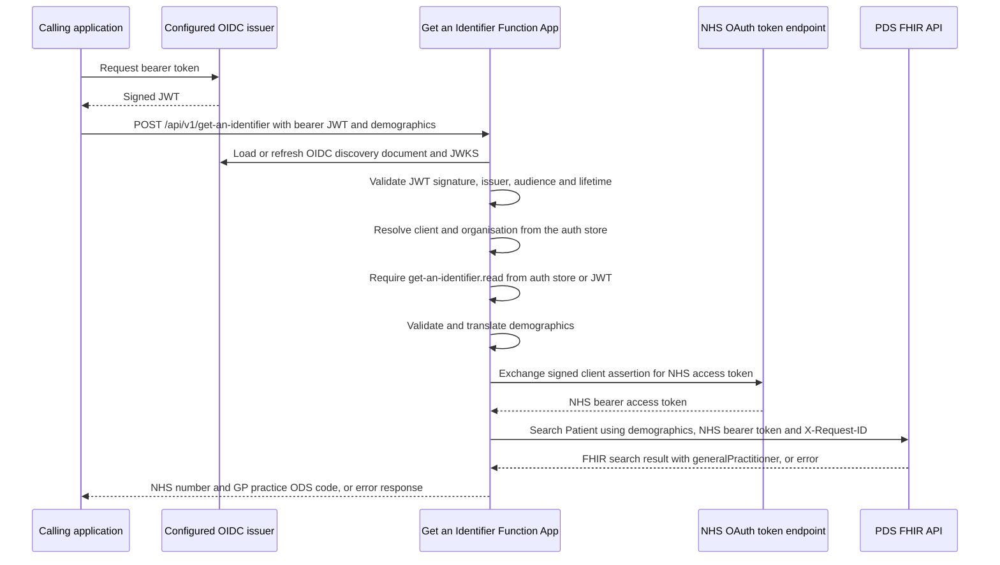

# Get an Identifier: as-built design

**Last checked:** `2026-10-01`

**Status:** Implemented behaviour on `main`

This page describes the current Get an Identifier request path. It is deliberately narrower than the proposed SUI architecture and should be updated when the implementation changes.

## Current request path

```mermaid
sequenceDiagram
    participant Caller as Calling application
    participant Issuer as Configured OIDC issuer
    participant Function as Get an Identifier Function App
    participant NHSAuth as NHS OAuth token endpoint
    participant PDS as PDS FHIR API

    Caller->>Issuer: Request bearer token
    Issuer-->>Caller: Signed JWT
    Caller->>Function: POST /api/v1/get-an-identifier with bearer JWT and demographics
    Function->>Issuer: Load or refresh OIDC discovery document and JWKS
    Function->>Function: Validate JWT signature, issuer, audience and lifetime
    Function->>Function: Resolve client and organisation from the auth store
    Function->>Function: Require get-an-identifier.read from auth store or JWT
    Function->>Function: Validate and translate demographics
    Function->>NHSAuth: Exchange signed client assertion for NHS access token
    NHSAuth-->>Function: NHS bearer access token
    Function->>PDS: Search Patient using demographics, NHS bearer token and X-Request-ID
    PDS-->>Function: FHIR search result with generalPractitioner, or error
    Function-->>Caller: NHS number and GP practice ODS code, or error response
```

The application validates JWTs itself using the configured OIDC discovery document. AuthEmulator supplies this contract for local development. Deployed environments can use a different issuer through configuration; FaUAPI gateway routing and authentication policy are configured separately from this application. See [authentication by environment](#authentication-by-environment) for the intended setup and the limits of what repository configuration confirms.

The operation requires a valid bearer JWT and the `get-an-identifier.read` permission. Permissions are resolved from the configured auth store or token scopes according to `AuthSettings:UseAuthStoreForAuthorisation`.

The Function App uses `AuthorizationLevel.Anonymous` because these checks are performed in application code rather than by an Azure Functions host key.

## Match response

A successful match returns the NHS number as `PersonId` and `GeneralPractitioner` as a collection containing the ODS code from the PDS FHIR `Patient.generalPractitioner` field. The collection is empty when PDS does not supply a registered practice, including for records where location-sensitive fields are withheld.

Get an Identifier does not call the Organisation Data Service FHIR API or enrich the ODS code with practice details.

## Configuration boundaries

Inbound authentication is provider-neutral and configured through `AuthSettings`:

- `Issuer`
- `Audience`
- `OidcDiscoveryUrl`
- `AccessTokenUrl`, which supplies the token endpoint in the generated OpenAPI client-credentials security scheme and the token URL used by post-deployment smoke tests
- `OauthScope`, which supplies the advertised scope in that scheme and the scope requested by post-deployment smoke tests when configured
- `UseAuthStoreForAuthorisation`

After validating a token, the current `AuthContextFactory` always resolves its client and organisation against the bundled auth store. The client must exist, be enabled and have an organisation ID. `UseAuthStoreForAuthorisation` controls where the required `get-an-identifier.read` permission is obtained:

- `true`: the auth-store client's `AllowedScopes` must include the permission; the JWT does not need to contain it.
- `false`: the permission must be present in the JWT's `scp`, `scope`, `roles` or `role` claims.

The switch does not disable the client lookup or the endpoint's permission check. `OauthScope` advertises the OAuth scope to request from the issuer; it does not change the permission enforced by the endpoint.

The application reads NHS OAuth and PDS configuration through `NhsAuthConfig`. The private key, key identifier and NHS client ID are supplied to deployed environments through Key Vault references.

The runtime-generated API description is available from `/api/openapi/v3.json`, with Swagger UI at `/api/swagger/ui`. The operation declares an OAuth2 client-credentials security scheme. At runtime, the operation requires a valid bearer JWT and the `get-an-identifier.read` permission from the source selected by `UseAuthStoreForAuthorisation`.

## Authentication by environment

The intended environment strategy separates gateway routing from token issuance:

| Environment | Intended access and authentication                                            | Purpose                                                                                                         |
| ----------- | ----------------------------------------------------------------------------- | --------------------------------------------------------------------------------------------------------------- |
| Local       | Call the local Function App directly using a JWT from local AuthEmulator.     | Fast, self-contained development without a FaUAPI dependency.                                                   |
| `d01`       | Route through FaUAPI while using AuthEmulator for tokens.                     | Exercise hosted routing while keeping authentication close to local development.                                |
| `d02`       | Use FaUAPI for routing and its configured authentication provider for tokens. | Exercise the integrated gateway and authentication path; compare with `d01` when diagnosing integration issues. |
| `d03`       | Use the intended production gateway and authentication path.                  | Pre-production validation with a clean environment and production-like configuration.                           |

This table records the target strategy, not a verified inventory of live gateway policies or Azure app settings. The repository confirms the following configuration:

- The [local settings example](../../../Apps/GetAnIdentifier/src/SUI.GetAnIdentifier.API/example.local.settings.json) points to AuthEmulator at `https://localhost:7250` and sets `UseAuthStoreForAuthorisation` to `false`, so local tokens must carry `get-an-identifier.read`.
- Terraform enables AuthEmulator deployment in [`d01`](../../../terraform/environments/d01.tfvars) and [`d02`](../../../terraform/environments/d02.tfvars), and disables it in [`d03`](../../../terraform/environments/d03.tfvars). Deploying an emulator does not establish which issuer the Function App uses.
- `d01` and `d03` explicitly set `AuthSettings__UseAuthStoreForAuthorisation` to `true`. `d02` does not set it in its tfvars, so the application default is `false` unless deployment configuration overrides it.
- The [Terraform workflow](../../../.github/workflows/terraform-plan-and-apply.yml) supplies issuer, audience, discovery URL, token URL and advertised scope from GitHub Environment secrets. Their live values and FaUAPI configuration cannot be inferred from tfvars alone.

Before treating the target table as the deployed state, verify each Function App's effective `AuthSettings` and the corresponding FaUAPI route and authentication policy. In every mode, the application still validates the JWT and resolves the client and organisation through its auth store. FaUAPI-issued client IDs must therefore match the configured auth-store identities, including any private client-ID overrides.

For local setup, see the [Get an Identifier README](../../../Apps/GetAnIdentifier/README.md). For configuring the gateway, see the [FaUAPI endpoint setup guide](../FaUAPI/DeployEndpointToFaUAPI.md).

## Alpha direction and implementation boundaries

Get an Identifier is the main vendor-facing API for Alpha. The agreed direction extends matching with MNS subscriptions for matched people. Relevant lifecycle changes are to be received through MESH by the separate Notification Service, which will notify registered supplier webhook endpoints. Suppliers then rematch affected records through Get an Identifier; webhook notifications do not return replacement NHS numbers, GP details or demographics.

The current Get an Identifier request path stops after PDS matching and returning the response. It does not create MNS subscriptions, maintain identifier-to-custodian associations, or register or deliver webhooks.

The accepted decisions are:

- [MNS integration](../../architecture/decisions/System/GetAnIdentifier/0001-NHS-MNS-integration.md): use MESH as the Alpha notification transport.
- [Duplicate MNS subscription avoidance](../../architecture/decisions/System/GetAnIdentifier/0002-mns-duplicate-avoidance.md): subscribe first and remove duplicates asynchronously. Subscription creation and cleanup are not implemented in this request path.

The [Notification Service README](../../../Apps/NotificationService/README.md) describes its current host, register and signed delivery components and the remaining orchestration work. MESH message retrieval and parsing are implemented in the Notification Service; webhook dispatch and MESH acknowledgement are not yet wired into its orchestrator. The [supplier lifecycle webhook contract v1](../Notifications-Webhooks/SupplierLifecycle/V1/Index.md) remains Draft.

The earlier [distributed discovery webhook design](../Notifications-Webhooks/Index.md), polling-based `FIND` / `FETCH`, jobs and results material does not describe the current primary Alpha scope. The older [NEMS / MNS landscape ADR](../../architecture/decisions/Systems%20landscape/0014-demographic-event-integration-nems-mns.md) remains Draft; use the accepted Get an Identifier MNS decisions above for the current transport and subscription approach.
