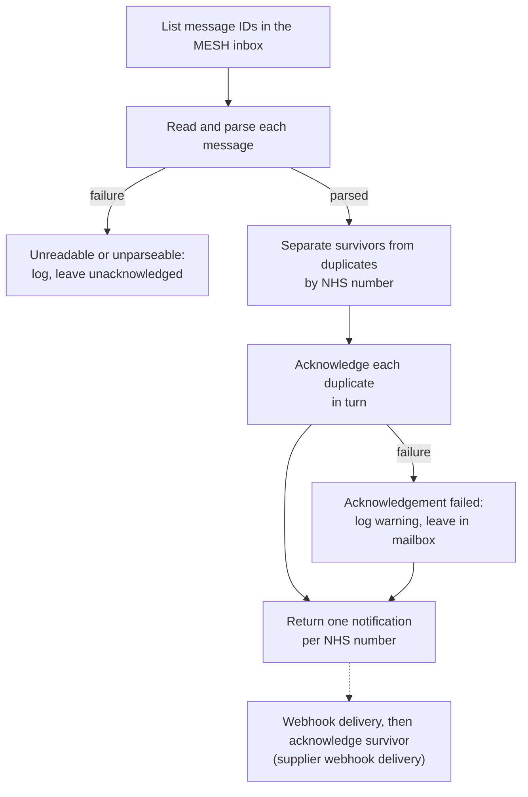

# Notification Service: duplicate message handling

**Date:** `2026-10-02`  
**Owner:** SUI Service Team  
**Jira:** SUI-1969

> **Status: proposed, not implemented.** This page describes how the Notification Service should handle duplicate MESH messages. It is not yet a description of what the service does.

This page describes how the Notification Service collapses MESH messages that carry the same NHS number, so that the supplier webhooks are given at most one notification per NHS number in each execution. An execution is one invocation of the Notification Service console app, which drains the mailbox and exits. Run instructions, configuration, exit codes and the general MESH behaviour are in the [Notification Service README](../../../Apps/NotificationService/README.md).

## Context

Get an Identifier subscribes to NHS Multicast Notification Service (MNS) events for the NHS numbers it returns. [ADR-GetAnIdentifier-0002](../../architecture/decisions/System/GetAnIdentifier/0002-mns-duplicate-avoidance.md) accepted that subscriptions are created without checking for an existing one, and that duplicate subscriptions are removed afterwards by a separate clean-up task. Until that clean-up runs, a single PDS change for a person with duplicate subscriptions is delivered to the MESH mailbox once per subscription.

Without handling, each of those messages would become its own supplier notification for the same person. Suppliers rematch through Get an Identifier on every notification, so the extra notifications cost them, and us, repeated work for no benefit.

The only event type subscribed to is `nhsNumberChanged`. Subscriptions are controlled by SUI, so no other event type reaches the mailbox.

## Scope

In scope:

- collapsing messages that carry the same NHS number within one execution;
- acknowledging the collapsed duplicates so they leave the MESH mailbox;
- the failure, cancellation and logging behaviour of that acknowledgement.

Out of scope:

- deduplication across executions;
- supplier webhook delivery, and acknowledging the surviving message once it has been delivered, through `IMeshMessageProcessor.AcknowledgeMessageAsync`. See the [Supplier lifecycle webhook contract](../Notifications-Webhooks/SupplierLifecycle/V1/Index.md);
- deriving the supplier `eventId`; and
- removing duplicate MNS subscriptions at source. This is the clean-up task from [ADR-GetAnIdentifier-0002](../../architecture/decisions/System/GetAnIdentifier/0002-mns-duplicate-avoidance.md).

## Behaviour

### What counts as a duplicate

A message is a duplicate when its NHS number has already been seen on a message with a different MESH message ID in the same execution. Nothing else is compared: not the event type, the Bundle, the MESH message metadata or the time of the change.
This is safe because the supplier payload carries only `eventType` and `affectedNhsNumber`, and suppliers rematch against current PDS data. Collapsing two messages for the same NHS number loses nothing a supplier would act on. It relies on `nhsNumberChanged` being the only event type received; if a second event type is ever subscribed to, this rule must be revisited, because a message of one type could then hide a message of the other.

Only messages that were read and parsed successfully take part. A message that cannot be read, cannot be parsed or carries no valid NHS number has no known NHS number, so it is never treated as a duplicate or as a survivor. It is logged and left unacknowledged, as described in the [Notification Service README](../../../Apps/NotificationService/README.md).

### Which message survives

The survivor is the first message for each NHS number, in the order the MESH inbox endpoint returns message IDs. MESH does not document an ordering for the inbox, so which copy survives is arbitrary. Nothing may depend on which copy survives: all copies are equivalent for the supplier.

Because the survivor is not acknowledged until webhook delivery succeeds, the same survivor can still be in the mailbox on later executions, and copies that arrive later are collapsed into it.

### Processing order

1. The whole mailbox is listed, read and parsed first.
2. The parsed notifications are separated into survivors and duplicates.
3. Each duplicate is acknowledged in turn, so MESH removes it from the mailbox.
4. Only the survivors are returned to the orchestrator.

Duplicates are acknowledged before any supplier delivery takes place. That cannot lose a change, because the survivor carrying the same NHS number stays in the mailbox until it has been delivered.

### Guarantee

Within one execution, the list of notifications returned for delivery contains each NHS number at most once. No guarantee is made across executions; see [Accepted limitations](#accepted-limitations).

## Failure handling

The rule throughout is that anything that fails stays in the MESH mailbox and is handled again on the next execution.

| Situation | Behaviour |
|---|---|
| Acknowledging a duplicate fails with an HTTP or timeout failure | Log a warning with the duplicate's MESH message ID and continue with the remaining duplicates. The duplicate stays in the mailbox. The execution's exit code is not affected. |
| A programming fault or other unexpected exception while acknowledging | Propagates, so the execution fails visibly with exit code `1`, consistent with how unexpected failures are handled when reading messages. |
| Execution cancelled while acknowledging duplicates | Stop acknowledging and end as cancelled (exit code `2`). Duplicates not yet acknowledged stay in the mailbox. |
| A duplicate left in the mailbox while its survivor is also still there | Collapsed again on the next execution. |
| A duplicate left in the mailbox after its survivor was delivered and acknowledged | Becomes the survivor on the next execution and is delivered. See [Accepted limitations](#accepted-limitations). |

## Logging

Logs follow the repository rule that PII is never logged. NHS numbers do not appear; MESH message IDs and counts do.

| Event | Level | Message |
|---|---|---|
| Duplicate acknowledged | Information | `MESH message {DuplicateMessageId} acknowledged as a duplicate of {SurvivorMessageId}` |
| Duplicate acknowledgement failed | Warning | The duplicate's MESH message ID and the exception. Warning rather than Error because it corrects itself on the next execution. |
| Execution summary | Information | The completion log includes the number of duplicates acknowledged and the number whose acknowledgement failed. |

Linking the duplicate message ID to its survivor's message ID is the trail of what was discarded and why. Console logs in Log Analytics are the only record of a duplicate acknowledgement; no separate audit record is written.

## Accepted limitations

Deduplication works within one execution only, because storing NHS numbers across executions is ruled out (see ADR-GetAnIdentifier-0002). A supplier can therefore still receive a second notification for the same NHS number when:

- **copies arrive in different executions.** If one copy is delivered and acknowledged before another copy reaches the mailbox, the later copy is delivered on its own next time. This is the more likely cause, and the subscription clean-up task is what reduces it.
- **a duplicate's acknowledgement fails in the same execution that its survivor is delivered and acknowledged.** The duplicate is delivered on the next execution.

Both outcomes are tolerated by the supplier contract, which is at-least-once delivery with suppliers deduplicating on `eventId`. Whether suppliers recognise the second notification as a repeat depends on the open question about `eventId` derivation below. If they do not, the cost is one extra rematch.

**Dependency:** this design assumes survivors are acknowledged after successful supplier webhook delivery. Until that happens, survivors stay in the mailbox and are collapsed again on each execution. MESH makes a message unavailable five days after it was sent, and NHS England can resend it within 30 days on request ([MESH client reference guide](https://digital.nhs.uk/developer/api-catalogue/message-exchange-for-social-care-and-health-api/mesh-client/mesh-client---reference-guide)), so a survivor that is never acknowledged is eventually lost from the mailbox without being delivered.

## Acceptance criteria

- Given several messages with the same NHS number, only the first is returned and every later copy is acknowledged.
- The survivor is not acknowledged.
- Given messages with distinct NHS numbers, all are returned and none is acknowledged.
- A failed duplicate acknowledgement does not stop the remaining duplicates being acknowledged or the survivors being returned.
- Cancellation during acknowledgement stops further acknowledgements and ends the execution as cancelled.
- An unparseable message does not take part in deduplication.

## Related

- [Notification Service README](../../../Apps/NotificationService/README.md)
- [ADR-GetAnIdentifier-0002: Avoiding duplicate MNS subscriptions](../../architecture/decisions/System/GetAnIdentifier/0002-mns-duplicate-avoidance.md)
- [Supplier lifecycle webhook contract v1](../Notifications-Webhooks/SupplierLifecycle/V1/Index.md)

## Open questions

1. **`eventId` derivation.** The supplier contract requires the same source change to produce the same `eventId`. Copies from duplicate subscriptions are different MESH messages. Should `eventId` be derived from the source PDS change rather than from the MESH message, so that a second notification caused by the limitations above is recognised by suppliers as a repeat? Owned by the webhook workstream.
2. **Subscription clean-up task.** The clean-up of duplicate MNS subscriptions from ADR-GetAnIdentifier-0002 is owned separately. Where it is tracked, and when it will run, determines how often the cross-execution limitation occurs, and should be linked from this page once known.
