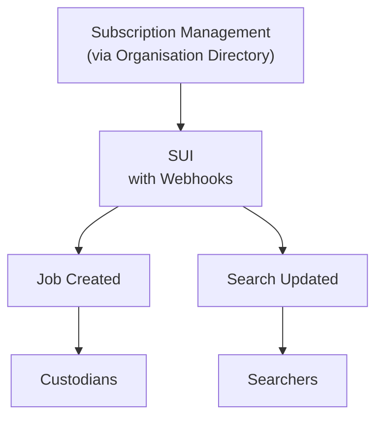

# Notifications (Webhooks) - Requirements and High-Level Design

**Date:** `2026-06-04`  
**Owner:** SUI Service Team  

This document outlines the key requirements, technical guidelines, and high-level design for adding Notifications to the SUI system.

## Goals

The goals and reasons for adding Notifications to the SUI system are:

* Relive the pressure that polling will put on the system.
* Ability for some number of search (find-record) results to be provided more quickly.

## Requirements

1. (Must have) Custodians should be able to be notified when they have Jobs, rather than having to poll for Jobs.
2. (Should have) Searchers should be able to be notified when their Search Request completes, rather than having to poll for Search Request completion.
    * Note that as this design has evolved, the most likely option to provide the best value will be to notify the Searchers about any significant status updates/changes.

## Technical Guidelines / Decisions

* Notifications will be implemented as **Webhooks**.
* The solution must **build upon Jobs**, so that:
  - There is a single mechanism for Custodians to submit results.
  - We reuse as much of the existing Work Items / Jobs / 'record discovery' implementation as possible to reduce implementation and maintenance effort.
* Security: Subscribers need to know it's actually us calling them and not a malicious actor.
  - We should use the industry standard for this which is **HMAC** (Hash-based Message Authentication Code).
  - At least **SHA256** should be used for the HMAC.
* Two subscriptions should be offered (to enable organisations to opt-in incrementally, and so that Custodian and Searcher contexts are kept seperate):
  1. `Job Created` subscription
  2. `Search Updated` subscription
* Notifications should avoid introducing new infrastructure technologies at this point (e.g. avoid introducing Azure Service Bus or Event Grid), so there are no architectural changes to the infrastructure stack.
* Subscribing to Webhooks should be **optional**, so that Polling is still offered as the baseline integration.

## High-Level Design

### Subscription Management
* Org Directory will need an optional ability for webhook URLs to be supplied (eventually the Custodians will supply these to us).
* Org Directory will need a private secret key per Custodian that we use to sign webhook payloads (HMAC), so that Custodians can verify to is us who has called them (payload is authentic), and that the payload hasn't been tampered with.

### Dispatching Notifications
* Dispatching should use message queues, so that:
  * the notification functionality doesn't block the main functionality, and
  * we can keep track of webhooks that completely fail (to enable alerts and/or manual replays).
* Processing of webhooks should include retries with backoff, up to a capped number of retries.
* Auditing:
  * Should probably reuse the existing `AuditEvent`.
    * The issue here is that the current `AuditEvent` storage table keys do not enable filtering by type, which would make extracting audit events for just webhooks problematic, ineffient, and possibly costly.
    * **We should change the `AuditEvent` storage keys** to the following to enable optimal filtering by type and/or time:
      * `PartitionKey`: `EventType`
      * `RowKey`: `{Timestamp:yyyy-MM-dd}_EventId`
  * After calling a webhook URL, log an `AuditEvent` on success or failure.
* Job Created Scenarios:
  * When a **Job is created** and the Custodian of the Job has a `Job Created` subscription,  
    Then the Custodian organisation should receive the notification on their Job Created webhook URL.
* Search Updated Scenarios:
  * When a **Search completes/expires/fails** and the initiating Searcher has a `Search Updated` subscription,  
    Then the Searching organisation should receive the notification on their Search Updated webhook URL,  
    And the notification should include the current `Status`, the `WorkItemId`, and current percentage complete.
  * When a **Search is updated on some interval** and the initiating Searcher has a `Search Updated` subscription,  
    Then the Searching organisation should receive the notification on their Search Updated webhook URL,  
    And the notification should include the Status as being `Running`, the `WorkItemId`, and current percentage complete.
      * The **interval** should probably be a configurable time-based interval, e.g. report progress every 5 seconds.

## Related Changes

### Stub Custodians - Webhook rather than Poll for Jobs
* For our mock Custodians that have `Job Created` subscriptions, they should not poll for Jobs, and instead we should have an HTTP endpoint for the `Job Created` webhook's destination.

### E2E Tests - Webhook rather than Poll for Search completion
* For our mock Searchers that have `Search Updated` subscriptions, the E2E Test logic should listen rather than poll for search results, for those applicable subscriptions.
* HTTP Streaming Idea:
  1. The Stub Custodians has an HTTP endpoint for the `Search Updated` webhook's destination.
  2. The Stub Custodians has an HTTP Streaming endpoint (Server-Sent Events, SSE, `text/event-stream`):
      * The streaming endpoint accepts the `WorkItemId` as a param, and should stream out any `Search Updated` events (received by the 'Search Updated Webhook' above) for that specified work item.
  3. The E2E Test logic listens to the HTTP Stream endpoint, rather than polling for search results, for those applicable subscriptions.
* The existing Version 2 E2E tests should be expanded to cover a mixture of polling and notifications/webhooks (with a higher ratio of notifications compared to polling).

### Maybe: "Ping" job
* For organisations to be able to test polling/webhooks.
* Question: how would this be invoked?  Admin endpoint / concept?
* Also, possibly, some way of knowing which Custodians are listening and responding.
  - This would likely require someway of the Custodians replying to the ping and the SUI system storing that.