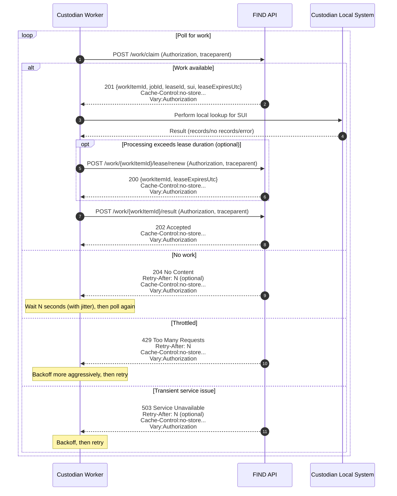

# Polling API Design: Custodian Work Claim and Result Submission

Date: 18 February 2026  
Owner: SUI Service Team  
Scope: Custodian-facing polling, lease claim, optional lease renewal, and result submission for FIND pull-based discovery.

This document describes the polling endpoints that enable custodians to pull discovery work from FIND, claim it under a lease, perform local lookup, and submit results.

It covers:

- Endpoint purposes and behaviour
- Required headers and status codes
- A sequence diagram showing the interaction
- An OpenAPI 3 specification you can implement against

---

## 1. Overview

### Goals

- **Cheap when idle**: most calls return “no work”.
- **One call = progress** when work exists (atomic claim).
- **Race-safe**: no split-phase “peek then claim” dependency.
- **Backpressure-aware**: server guides polling rate via `Retry-After`.
- **Proxy-safe**: responses must not be cached.
- **Traceable**: use W3C Trace Context (`traceparent`).

### Endpoints

| Endpoint | Purpose | Notes |
|---|---|---|
| `POST /work/claim` | Atomically claim the next available work item and obtain a lease | **Canonical** polling mechanism |
| `POST /work/{workItemId}/result` | Submit the result for a leased work item (accepted for async processing) | Validates lease ownership and expiry; enqueues result |
| `POST /work/{workItemId}/lease/renew` | Renew the lease for an in-progress work item | **Optional** capability |
| `HEAD /work/available` | Advisory signal that work is likely available | **Optional**, not relied upon for correctness |

---

## 2. Common HTTP Behaviour

### 2.1 Authentication

All endpoints require Bearer token authentication (unattended / M2M).

- Custodian identity MUST be derived from the token.
- Authorisation MUST ensure a custodian can only claim and submit/renew for its own work.

### 2.2 Tracing

Clients SHOULD send:

- `traceparent`
- `tracestate` (if used)

Server MUST:

- accept and propagate trace context,
- log Trace ID as canonical correlation identifier,
- include `workItemId`, `jobId`, and `leaseId` as log fields.

### 2.3 Cache control (mandatory)

All responses from the endpoints in this document MUST include:

```
Cache-Control: no-store, no-cache, max-age=0, must-revalidate
Pragma: no-cache
Expires: 0
Vary: Authorization
```

This applies to **all** responses including errors (`400/401/403/409/429/503`).

### 2.4 Backoff signalling

- For “no work”: return `204 No Content` and SHOULD include `Retry-After: <seconds>`.
- For throttling: return `429 Too Many Requests` and include `Retry-After: <seconds>`.
- For transient service issues: return `503 Service Unavailable` and MAY include `Retry-After: <seconds>`.

Clients MUST honour `Retry-After` and apply jittered backoff.

### 2.5 Idempotency and retries

- `POST /work/claim` MUST be safe under retries:
  - A retry MAY return the same leased item if the server can correlate and deduplicate.
  - Otherwise, the server MUST ensure the caller cannot accidentally claim multiple concurrent items beyond its policy/limits.
- `POST /work/{workItemId}/result` SHOULD be idempotent:
  - Repeated identical submissions for a completed work item SHOULD return `202 Accepted` (or `409 Conflict` if the server cannot safely treat it as idempotent).
- `POST /work/{workItemId}/lease/renew` SHOULD be idempotent within a short window (renewing a valid lease multiple times results in the same or extended expiry).

### 2.6 HTTP/2

HTTP/2 MAY be enabled as a transport optimisation (connection multiplexing, reduced overhead under concurrency).  
The API MUST remain fully functional over HTTP/1.1. Clients SHALL NOT be required to configure HTTP/2 explicitly.

---

## 3. Endpoint Design

### 3.1 `POST /work/claim` (Canonical)

**Purpose**  
Return the next available work item for the authenticated custodian and **atomically lease it**.

**Request**  
No body required.

**Responses**

- `201 Created` — work item claimed; response includes lease metadata and expiry.
- `204 No Content` — no work available; SHOULD include `Retry-After`.
- `401 Unauthorized` / `403 Forbidden` — auth/authZ failure.
- `429 Too Many Requests` — caller must slow down; includes `Retry-After`.
- `503 Service Unavailable` — transient service issue; MAY include `Retry-After`.

**Response body (201)**

```json
{
  "workItemId": "abc123",
  "jobId": "job789",
  "leaseId": "lease456",
  "sui": "9434765919",
  "leaseExpiresUtc": "2026-02-17T12:34:56Z"
}
```

---

### 3.2 `POST /work/{workItemId}/result` (Submit result; accepted for async processing)

**Purpose**  
Submit the result of processing a previously leased work item.

**Behaviour**  
The API validates the lease and enqueues the result for asynchronous processing (`JobResultsInbound`). Domain writes (for example inserting `SearchResults`) occur in the queue processor.

**Requirements**

Server MUST validate:

- the work item exists,
- the work item is currently leased,
- the lease is owned by the authenticated custodian,
- the lease has not expired,
- the submitted `leaseId` matches the current lease.

If lease validation fails, server MUST return `409 Conflict`.

**Result payload shape**

Result payloads vary by `JobType`.

- For `JobType = CustodianLookup` (search fan-out), the request SHOULD include `records[]` of `{ systemId, recordType, recordUrl }`.
- For other job types, the request MAY omit `records[]` and instead supply a job-specific `payload` object.

**Request body**

```json
{
  "jobId": "job789",
  "leaseId": "lease456",
  "resultType": "HasRecords",
  "records": [
    {
      "systemId": "cust-123",
      "recordType": "SAFEGUARDING_PTR",
      "recordUrl": "https://custodian.example/records/xyz"
    }
  ]
}
```

**Responses**

- `202 Accepted` — validated and enqueued.
- `400 Bad Request` — invalid payload/schema.
- `401 Unauthorized` / `403 Forbidden` — auth/authZ failure.
- `409 Conflict` — lease invalid/expired or not owned by caller.
- `429 Too Many Requests` — includes `Retry-After`.
- `503 Service Unavailable` — transient service issue; MAY include `Retry-After`.

---

### 3.3 `POST /work/{workItemId}/lease/renew` (Optional)

**Purpose**  
Extend the lease for a work item that is still being processed.

**Important**  
This endpoint is optional. If not implemented in Alpha, custodians MUST complete processing before `leaseExpiresUtc` and submit the result within the existing lease duration.

**Request body**

```json
{
  "jobId": "job789",
  "leaseId": "lease456"
}
```

**Responses**

- `200 OK` — lease renewed; response includes updated expiry.
- `400 Bad Request` — invalid work item id.
- `401 Unauthorized` / `403 Forbidden` — auth/authZ failure.
- `409 Conflict` — lease invalid/expired or not owned by caller.
- `429 Too Many Requests` — includes `Retry-After`.
- `503 Service Unavailable` — transient service issue; MAY include `Retry-After`.

**Response body (200)**

```json
{
  "workItemId": "abc123",
  "leaseExpiresUtc": "2026-02-17T12:44:56Z"
}
```

---

### 3.4 `HEAD /work/available` (Optional, advisory only)

**Purpose**  
Provide a lightweight signal that work is likely available for the authenticated custodian.

**Important**  
This endpoint MUST NOT be relied upon for correctness. It is advisory and subject to races. The claim endpoint remains authoritative.

**Responses**

- `200 OK` — work likely available at evaluation time.
- `204 No Content` — no work available at evaluation time; SHOULD include `Retry-After`.
- `401 Unauthorized` / `403 Forbidden` — auth/authZ failure.
- `429 Too Many Requests` — includes `Retry-After`.
- `503 Service Unavailable` — transient service issue; MAY include `Retry-After`.

---

## 4. Sequence Diagram



If you implement the optional availability probe, it can sit before `/work/claim`, but does not replace it.

---

## 5. OpenAPI 3 Specification (YAML)

```yaml
openapi: 3.0.3
info:
  title: FIND Custodian Polling API
  version: 0.3.0
  description: |
    Polling endpoints for custodians to claim discovery work under a lease, optionally renew a lease, and submit results.
    Result submission is accepted for asynchronous processing (queued) and is safe under retries when implemented idempotently.

servers:
  - url: https://find.example.gov.uk

security:
  - bearerAuth: []

tags:
  - name: Work
    description: Work claim, optional lease renewal, and result submission

paths:
  /work/claim:
    post:
      tags: [Work]
      summary: Claim the next available work item (atomic lease)
      description: |
        Atomically selects and leases the next available work item for the authenticated custodian.
        Returns 204 when no work exists (Retry-After may be present).
        Signals backpressure with 429 (Retry-After present), and transient service issues with 503 (Retry-After may be present).
      operationId: claimWork
      parameters:
        - name: traceparent
          in: header
          required: false
          schema: { type: string }
          description: W3C Trace Context traceparent header.
        - name: tracestate
          in: header
          required: false
          schema: { type: string }
          description: W3C Trace Context tracestate header.
      responses:
        "201":
          description: Work item claimed
          headers:
            Cache-Control: { schema: { type: string } }
            Pragma: { schema: { type: string } }
            Expires: { schema: { type: string } }
            Vary: { schema: { type: string } }
          content:
            application/json:
              schema:
                $ref: "#/components/schemas/WorkClaimResponse"
        "204":
          description: No work available
          headers:
            Retry-After:
              schema: { type: integer, minimum: 0 }
              description: Backoff duration in seconds (may be omitted).
            Cache-Control: { schema: { type: string } }
            Pragma: { schema: { type: string } }
            Expires: { schema: { type: string } }
            Vary: { schema: { type: string } }
        "401":
          description: Unauthorised
          headers:
            Cache-Control: { schema: { type: string } }
            Pragma: { schema: { type: string } }
            Expires: { schema: { type: string } }
            Vary: { schema: { type: string } }
        "403":
          description: Forbidden
          headers:
            Cache-Control: { schema: { type: string } }
            Pragma: { schema: { type: string } }
            Expires: { schema: { type: string } }
            Vary: { schema: { type: string } }
        "429":
          description: Too many requests
          headers:
            Retry-After:
              schema: { type: integer, minimum: 0 }
              description: Backoff duration in seconds.
            Cache-Control: { schema: { type: string } }
            Pragma: { schema: { type: string } }
            Expires: { schema: { type: string } }
            Vary: { schema: { type: string } }
        "503":
          description: Service unavailable (transient)
          headers:
            Retry-After:
              schema: { type: integer, minimum: 0 }
              description: Backoff duration in seconds (may be omitted).
            Cache-Control: { schema: { type: string } }
            Pragma: { schema: { type: string } }
            Expires: { schema: { type: string } }
            Vary: { schema: { type: string } }

  /work/available:
    head:
      tags: [Work]
      summary: Advisory availability probe (optional)
      description: |
        Optional endpoint. Returns 200 if work is likely available at evaluation time, otherwise 204.
        This is advisory only and must not be relied upon for correctness.
      operationId: headWorkAvailable
      parameters:
        - name: traceparent
          in: header
          required: false
          schema: { type: string }
        - name: tracestate
          in: header
          required: false
          schema: { type: string }
      responses:
        "200":
          description: Work likely available
          headers:
            Cache-Control: { schema: { type: string } }
            Pragma: { schema: { type: string } }
            Expires: { schema: { type: string } }
            Vary: { schema: { type: string } }
        "204":
          description: No work available
          headers:
            Retry-After:
              schema: { type: integer, minimum: 0 }
              description: Backoff duration in seconds (may be omitted).
            Cache-Control: { schema: { type: string } }
            Pragma: { schema: { type: string } }
            Expires: { schema: { type: string } }
            Vary: { schema: { type: string } }
        "401":
          description: Unauthorised
          headers:
            Cache-Control: { schema: { type: string } }
            Pragma: { schema: { type: string } }
            Expires: { schema: { type: string } }
            Vary: { schema: { type: string } }
        "403":
          description: Forbidden
          headers:
            Cache-Control: { schema: { type: string } }
            Pragma: { schema: { type: string } }
            Expires: { schema: { type: string } }
            Vary: { schema: { type: string } }
        "429":
          description: Too many requests
          headers:
            Retry-After:
              schema: { type: integer, minimum: 0 }
            Cache-Control: { schema: { type: string } }
            Pragma: { schema: { type: string } }
            Expires: { schema: { type: string } }
            Vary: { schema: { type: string } }
        "503":
          description: Service unavailable (transient)
          headers:
            Retry-After:
              schema: { type: integer, minimum: 0 }
              description: Backoff duration in seconds (may be omitted).
            Cache-Control: { schema: { type: string } }
            Pragma: { schema: { type: string } }
            Expires: { schema: { type: string } }
            Vary: { schema: { type: string } }

  /work/{workItemId}/result:
    post:
      tags: [Work]
      summary: Submit result for a leased work item (accepted for async processing)
      description: |
        Submits the outcome of processing a leased work item. The server validates lease ownership and expiry.
        On success, the result is enqueued for asynchronous processing and the request returns 202.
      operationId: submitWorkResult
      parameters:
        - name: workItemId
          in: path
          required: true
          schema: { type: string }
        - name: traceparent
          in: header
          required: false
          schema: { type: string }
        - name: tracestate
          in: header
          required: false
          schema: { type: string }
      requestBody:
        required: true
        content:
          application/json:
            schema:
              $ref: "#/components/schemas/WorkResultRequest"
      responses:
        "202":
          description: Accepted and enqueued for processing
          headers:
            Cache-Control: { schema: { type: string } }
            Pragma: { schema: { type: string } }
            Expires: { schema: { type: string } }
            Vary: { schema: { type: string } }
        "400":
          description: Bad request (validation/schema error)
          headers:
            Cache-Control: { schema: { type: string } }
            Pragma: { schema: { type: string } }
            Expires: { schema: { type: string } }
            Vary: { schema: { type: string } }
        "401":
          description: Unauthorised
          headers:
            Cache-Control: { schema: { type: string } }
            Pragma: { schema: { type: string } }
            Expires: { schema: { type: string } }
            Vary: { schema: { type: string } }
        "403":
          description: Forbidden
          headers:
            Cache-Control: { schema: { type: string } }
            Pragma: { schema: { type: string } }
            Expires: { schema: { type: string } }
            Vary: { schema: { type: string } }
        "409":
          description: Conflict (lease invalid/expired or not owned by caller)
          headers:
            Cache-Control: { schema: { type: string } }
            Pragma: { schema: { type: string } }
            Expires: { schema: { type: string } }
            Vary: { schema: { type: string } }
        "429":
          description: Too many requests
          headers:
            Retry-After:
              schema: { type: integer, minimum: 0 }
            Cache-Control: { schema: { type: string } }
            Pragma: { schema: { type: string } }
            Expires: { schema: { type: string } }
            Vary: { schema: { type: string } }
        "503":
          description: Service unavailable (transient)
          headers:
            Retry-After:
              schema: { type: integer, minimum: 0 }
              description: Backoff duration in seconds (may be omitted).
            Cache-Control: { schema: { type: string } }
            Pragma: { schema: { type: string } }
            Expires: { schema: { type: string } }
            Vary: { schema: { type: string } }

  /work/{workItemId}/lease/renew:
    post:
      tags: [Work]
      summary: Renew the lease for a work item (optional)
      description: |
        Optional endpoint. Extends the lease for an in-progress work item.
        The server validates lease ownership and expiry.
      operationId: renewWorkLease
      parameters:
        - name: workItemId
          in: path
          required: true
          schema: { type: string }
        - name: traceparent
          in: header
          required: false
          schema: { type: string }
        - name: tracestate
          in: header
          required: false
          schema: { type: string }
      requestBody:
        required: true
        content:
          application/json:
            schema:
              $ref: "#/components/schemas/LeaseRenewRequest"
      responses:
        "200":
          description: Lease renewed
          headers:
            Cache-Control: { schema: { type: string } }
            Pragma: { schema: { type: string } }
            Expires: { schema: { type: string } }
            Vary: { schema: { type: string } }
          content:
            application/json:
              schema:
                $ref: "#/components/schemas/LeaseRenewResponse"
        "400":
          description: Bad request
          headers:
            Cache-Control: { schema: { type: string } }
            Pragma: { schema: { type: string } }
            Expires: { schema: { type: string } }
            Vary: { schema: { type: string } }
        "401":
          description: Unauthorised
          headers:
            Cache-Control: { schema: { type: string } }
            Pragma: { schema: { type: string } }
            Expires: { schema: { type: string } }
            Vary: { schema: { type: string } }
        "403":
          description: Forbidden
          headers:
            Cache-Control: { schema: { type: string } }
            Pragma: { schema: { type: string } }
            Expires: { schema: { type: string } }
            Vary: { schema: { type: string } }
        "409":
          description: Conflict (lease invalid/expired or not owned by caller)
          headers:
            Cache-Control: { schema: { type: string } }
            Pragma: { schema: { type: string } }
            Expires: { schema: { type: string } }
            Vary: { schema: { type: string } }
        "429":
          description: Too many requests
          headers:
            Retry-After:
              schema: { type: integer, minimum: 0 }
            Cache-Control: { schema: { type: string } }
            Pragma: { schema: { type: string } }
            Expires: { schema: { type: string } }
            Vary: { schema: { type: string } }
        "503":
          description: Service unavailable (transient)
          headers:
            Retry-After:
              schema: { type: integer, minimum: 0 }
              description: Backoff duration in seconds (may be omitted).
            Cache-Control: { schema: { type: string } }
            Pragma: { schema: { type: string } }
            Expires: { schema: { type: string } }
            Vary: { schema: { type: string } }

components:
  securitySchemes:
    bearerAuth:
      type: http
      scheme: bearer
      bearerFormat: JWT

  schemas:
    WorkClaimResponse:
      type: object
      required: [workItemId, jobId, leaseId, sui, leaseExpiresUtc]
      properties:
        workItemId:
          type: string
          description: Unique identifier for the leased work item.
        jobId:
          type: string
          description: Identifier of the discovery job this work item belongs to.
        leaseId:
          type: string
          description: Lease identifier required for renew and result submission.
        sui:
          type: string
          description: Subject identifier used for discovery (e.g. NHS number).
        leaseExpiresUtc:
          type: string
          format: date-time
          description: UTC timestamp when the lease expires.

    LeaseRenewRequest:
      type: object
      required: [jobId, leaseId]
      properties:
        jobId:
          type: string
          description: Identifier of the discovery job this work item belongs to.
        leaseId:
          type: string
          description: Lease identifier being renewed.

    LeaseRenewResponse:
      type: object
      required: [workItemId, leaseExpiresUtc]
      properties:
        workItemId:
          type: string
          description: Unique identifier for the leased work item.
        leaseExpiresUtc:
          type: string
          format: date-time
          description: UTC timestamp when the renewed lease expires.

    WorkResultRequest:
      type: object
      required: [jobId, leaseId, resultType]
      properties:
        jobId:
          type: string
          description: Identifier of the discovery job this work item belongs to.
        leaseId:
          type: string
          description: Lease identifier under which the result is being submitted.
        resultType:
          type: string
          enum: [HasRecords, NoRecords, TemporaryError, PermanentError]
        records:
          type: array
          items:
            $ref: "#/components/schemas/SearchRecordPointer"
          description: Present when resultType=HasRecords for search fan-out jobs.
        payload:
          type: object
          additionalProperties: true
          description: Optional job-type specific payload for non-search job types.

    SearchRecordPointer:
      type: object
      required: [systemId, recordType, recordUrl]
      properties:
        systemId:
          type: string
          description: Custodian-local identifier for the subject.
        recordType:
          type: string
          description: Logical record type identifier.
        recordUrl:
          type: string
          format: uri
          description: URL to retrieve the record (pointer only).
```
