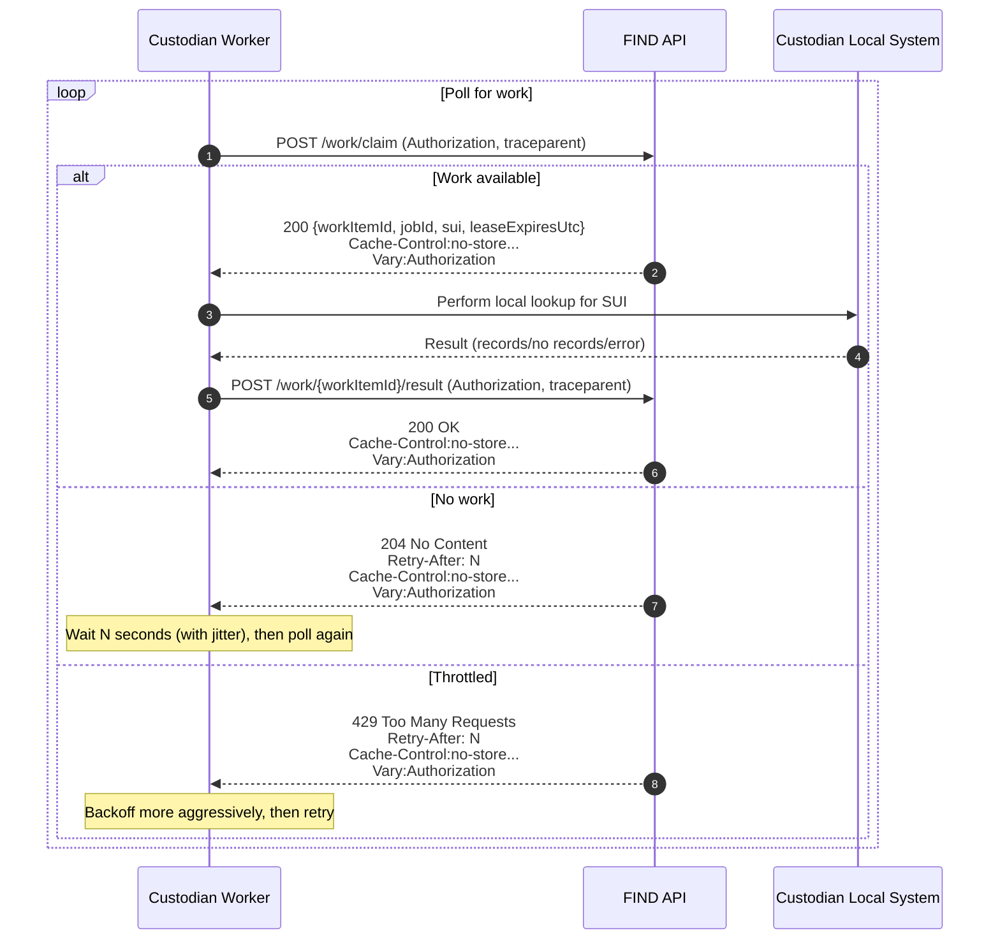

# Polling API Design: Custodian Work Claim and Result Submission

This document describes the polling endpoints that enable custodians to pull discovery work from FIND, claim it under a lease, perform local lookup, and submit results.

It covers:

- Endpoint purposes and behaviour
- Required headers and status codes
- A sequence diagram showing the interaction
- An OpenAPI 3 specification you can implement against

---

## 1. Overview

### Goals

- **Cheap when idle**: most calls return “no work”.
- **One call = progress** when work exists (atomic claim).
- **Race-safe**: no split-phase “peek then claim” dependency.
- **Backpressure-aware**: server guides polling rate via `Retry-After`.
- **Proxy-safe**: responses must not be cached.
- **Traceable**: use W3C Trace Context (`traceparent`).

### Endpoints

| Endpoint | Purpose | Notes |
|---|---|---|
| `POST /work/claim` | Atomically claim the next available work item and obtain a lease | **Canonical** polling mechanism |
| `POST /work/{workItemId}/result` | Submit the result for a leased work item | Must validate lease ownership and expiry |
| `HEAD /work/available` | Advisory signal that work is likely available | **Optional**, not relied upon for correctness |

---

## 2. Common HTTP Behaviour

### 2.1 Authentication

All endpoints require Bearer token authentication (unattended / M2M).

- Custodian identity MUST be derived from the token.
- Authorisation MUST ensure a custodian can only claim and submit for its own work.

### 2.2 Tracing

Clients SHOULD send:

- `traceparent`
- `tracestate` (if used)

Server MUST:

- accept and propagate trace context,
- log Trace ID as canonical correlation identifier,
- include `workItemId` and `jobId` as log fields.

### 2.3 Cache control (mandatory)

All responses from the endpoints in this document MUST include:

```
Cache-Control: no-store, no-cache, max-age=0, must-revalidate
Pragma: no-cache
Expires: 0
Vary: Authorization
```

### 2.4 Backoff signalling

- For “no work”: return `204 No Content` and include `Retry-After: <seconds>`.
- For throttling: return `429 Too Many Requests` and include `Retry-After: <seconds>`.

Clients MUST honour `Retry-After` and apply jittered backoff.

### 2.5 HTTP/2

HTTP/2 MAY be enabled as a transport optimisation (connection multiplexing, reduced overhead under concurrency).  
The API MUST remain fully functional over HTTP/1.1. Clients SHALL NOT be required to configure HTTP/2 explicitly.

---

## 3. Endpoint Design

### 3.1 `POST /work/claim` (Canonical)

**Purpose**  
Return the next available work item for the authenticated custodian and **atomically lease it**.

**Request**  
No body required.

**Responses**

- `200 OK` — work item claimed; response includes lease expiry.
- `204 No Content` — no work available; includes `Retry-After`.
- `401 Unauthorized` / `403 Forbidden` — auth/authZ failure.
- `429 Too Many Requests` — caller must slow down; includes `Retry-After`.

**Response body (200)**

```json
{
  "workItemId": "abc123",
  "jobId": "job789",
  "sui": "9434765919",
  "leaseExpiresUtc": "2026-02-17T12:34:56Z"
}
```

---

### 3.2 `POST /work/{workItemId}/result`

**Purpose**  
Submit the result of processing a previously leased work item.

**Requirements**

- Server MUST validate:
  - the work item exists,
  - the work item is currently leased,
  - the lease is owned by the authenticated custodian,
  - the lease has not expired.
- If lease validation fails, server MUST return `409 Conflict`.

**Request body**

```json
{
  "resultType": "HasRecords",
  "records": [
    {
      "type": "SAFEGUARDING_PTR",
      "recordUrl": "https://custodian.example/records/xyz"
    }
  ]
}
```

**Responses**

- `200 OK` — accepted.
- `400 Bad Request` — invalid payload/schema.
- `401 Unauthorized` / `403 Forbidden` — auth/authZ failure.
- `409 Conflict` — lease invalid/expired or not owned by caller.

---

### 3.3 `HEAD /work/available` (Optional, advisory only)

**Purpose**  
Provide a lightweight signal that work is likely available for the authenticated custodian.

**Important**  
This endpoint MUST NOT be relied upon for correctness. It is advisory and subject to races. The claim endpoint remains authoritative.

**Responses**

- `200 OK` — work likely available at evaluation time.
- `204 No Content` — no work available at evaluation time; includes `Retry-After`.
- `401 Unauthorized` / `403 Forbidden` — auth/authZ failure.
- `429 Too Many Requests` — includes `Retry-After`.

---

## 4. Sequence Diagram



If you later choose to implement the optional availability probe, it sits before `/work/claim`, but does not replace it.

---

## 5. OpenAPI 3 Specification (YAML)

```yaml
openapi: 3.0.3
info:
  title: FIND Custodian Polling API
  version: 0.1.0
  description: |
    Polling endpoints for custodians to claim discovery work under a lease and submit results.
servers:
  - url: https://find.example.gov.uk
security:
  - bearerAuth: []
tags:
  - name: Work
    description: Work claim and result submission

paths:
  /work/claim:
    post:
      tags: [Work]
      summary: Claim the next available work item (atomic lease)
      description: |
        Atomically selects and leases the next available work item for the authenticated custodian.
        Returns 204 when no work exists, with Retry-After to guide backoff.
      operationId: claimWork
      parameters:
        - name: traceparent
          in: header
          required: false
          schema:
            type: string
          description: W3C Trace Context traceparent header.
        - name: tracestate
          in: header
          required: false
          schema:
            type: string
          description: W3C Trace Context tracestate header.
      responses:
        "200":
          description: Work item claimed
          headers:
            Cache-Control:
              schema: { type: string }
            Pragma:
              schema: { type: string }
            Expires:
              schema: { type: string }
            Vary:
              schema: { type: string }
          content:
            application/json:
              schema:
                $ref: "#/components/schemas/WorkClaimResponse"
        "204":
          description: No work available
          headers:
            Retry-After:
              schema:
                type: integer
                minimum: 0
              description: Backoff duration in seconds.
            Cache-Control:
              schema: { type: string }
            Pragma:
              schema: { type: string }
            Expires:
              schema: { type: string }
            Vary:
              schema: { type: string }
        "401":
          description: Unauthorised
        "403":
          description: Forbidden
        "429":
          description: Too many requests
          headers:
            Retry-After:
              schema:
                type: integer
                minimum: 0
              description: Backoff duration in seconds.
            Cache-Control:
              schema: { type: string }
            Pragma:
              schema: { type: string }
            Expires:
              schema: { type: string }
            Vary:
              schema: { type: string }

  /work/available:
    head:
      tags: [Work]
      summary: Advisory availability probe (optional)
      description: |
        Optional endpoint. Returns 200 if work is likely available at evaluation time, otherwise 204.
        This is advisory only and must not be relied upon for correctness.
      operationId: headWorkAvailable
      parameters:
        - name: traceparent
          in: header
          required: false
          schema:
            type: string
        - name: tracestate
          in: header
          required: false
          schema:
            type: string
      responses:
        "200":
          description: Work likely available
          headers:
            Cache-Control:
              schema: { type: string }
            Pragma:
              schema: { type: string }
            Expires:
              schema: { type: string }
            Vary:
              schema: { type: string }
        "204":
          description: No work available
          headers:
            Retry-After:
              schema:
                type: integer
                minimum: 0
            Cache-Control:
              schema: { type: string }
            Pragma:
              schema: { type: string }
            Expires:
              schema: { type: string }
            Vary:
              schema: { type: string }
        "401":
          description: Unauthorised
        "403":
          description: Forbidden
        "429":
          description: Too many requests
          headers:
            Retry-After:
              schema:
                type: integer
                minimum: 0
            Cache-Control:
              schema: { type: string }
            Pragma:
              schema: { type: string }
            Expires:
              schema: { type: string }
            Vary:
              schema: { type: string }

  /work/{workItemId}/result:
    post:
      tags: [Work]
      summary: Submit result for a leased work item
      description: |
        Submits the outcome of processing a leased work item. The server validates lease ownership and expiry.
      operationId: submitWorkResult
      parameters:
        - name: workItemId
          in: path
          required: true
          schema:
            type: string
        - name: traceparent
          in: header
          required: false
          schema:
            type: string
        - name: tracestate
          in: header
          required: false
          schema:
            type: string
      requestBody:
        required: true
        content:
          application/json:
            schema:
              $ref: "#/components/schemas/WorkResultRequest"
      responses:
        "200":
          description: Accepted
          headers:
            Cache-Control:
              schema: { type: string }
            Pragma:
              schema: { type: string }
            Expires:
              schema: { type: string }
            Vary:
              schema: { type: string }
        "400":
          description: Bad request (validation/schema error)
        "401":
          description: Unauthorised
        "403":
          description: Forbidden
        "409":
          description: Conflict (lease invalid/expired or not owned by caller)
        "429":
          description: Too many requests
          headers:
            Retry-After:
              schema:
                type: integer
                minimum: 0
            Cache-Control:
              schema: { type: string }
            Pragma:
              schema: { type: string }
            Expires:
              schema: { type: string }
            Vary:
              schema: { type: string }

components:
  securitySchemes:
    bearerAuth:
      type: http
      scheme: bearer
      bearerFormat: JWT

  schemas:
    WorkClaimResponse:
      type: object
      required: [workItemId, jobId, sui, leaseExpiresUtc]
      properties:
        workItemId:
          type: string
          description: Unique identifier for the leased work item.
        jobId:
          type: string
          description: Identifier of the discovery job this work item belongs to.
        sui:
          type: string
          description: Subject identifier used for discovery (e.g. NHS number).
        leaseExpiresUtc:
          type: string
          format: date-time
          description: UTC timestamp when the lease expires.

    WorkResultRequest:
      type: object
      required: [resultType]
      properties:
        resultType:
          type: string
          enum: [HasRecords, NoRecords, TemporaryError, PermanentError]
        records:
          type: array
          items:
            $ref: "#/components/schemas/RecordPointer"
          description: Present when resultType=HasRecords.

    RecordPointer:
      type: object
      required: [type, recordUrl]
      properties:
        type:
          type: string
          description: Record type identifier.
        recordUrl:
          type: string
          format: uri
          description: URL to retrieve the record (pointer only).
```
